[toc]

# 正文

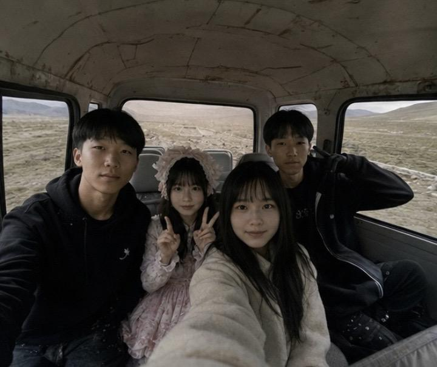

和三个朋友相约去西藏游玩沿途风光平和治愈，一路拍照说笑，满心期待山野美景。
与当地村民畅聊时，无意听说附近有一个巨大的洞窟，当我们继续问下去时他却闭口不谈，隔天我们私自走进洞窟，却发现村民也在这里，于是他说让我们进去后别说话。可是我们走着走着村民却不见了。
洞窟里死寂一片，压抑感瞬间裹住全身。当我们进去后发现地上有很多坛子，于是我们凑近观察发现有白色骨灰，后来我们四个人突然感觉一阵头晕目眩
（全文虚构，含悬疑惊悚元素，慎入）
#第一人称探险 #藏地秘境 #雪山洞窟 #诡异传说#王一博探索秘境

%

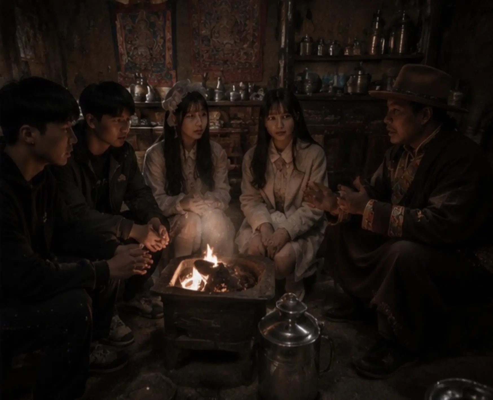

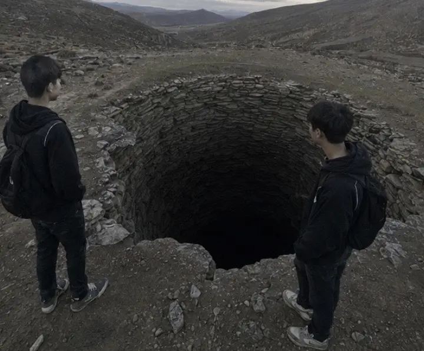

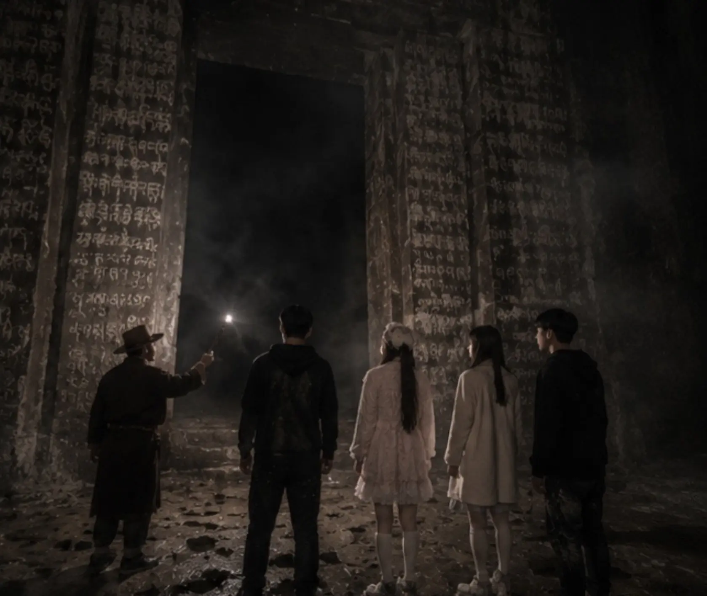

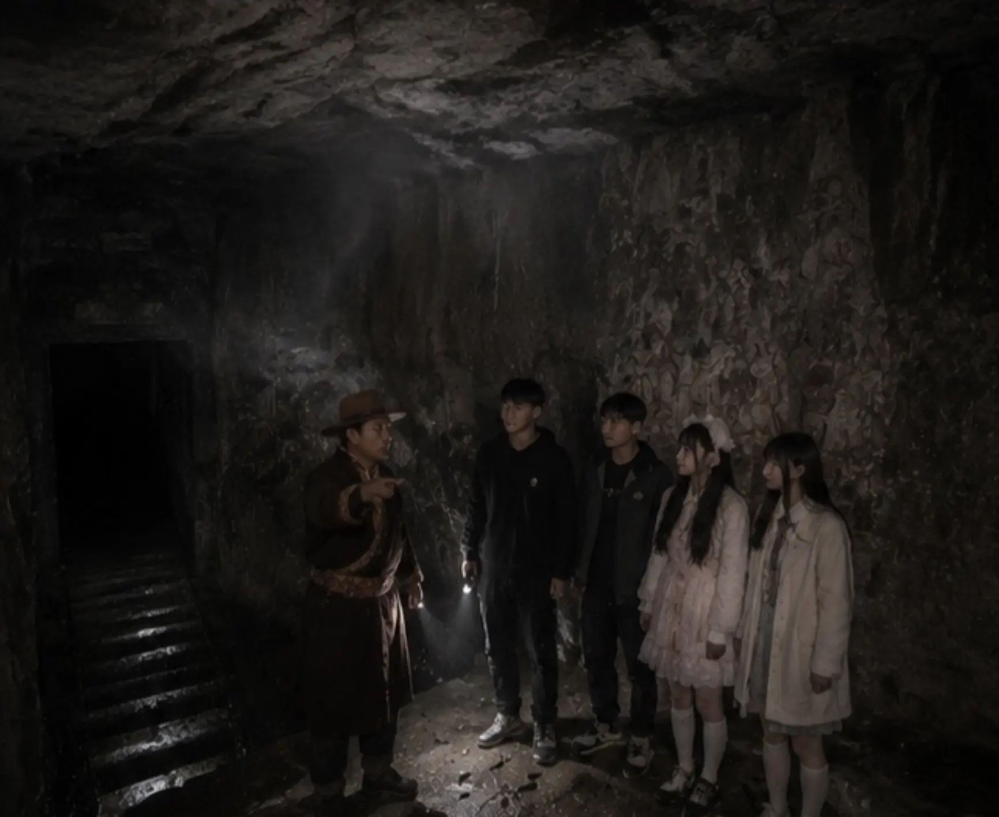

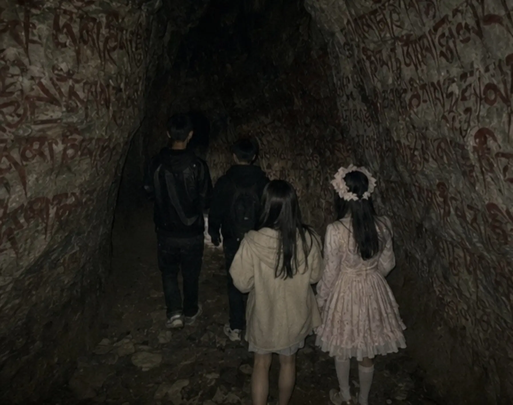

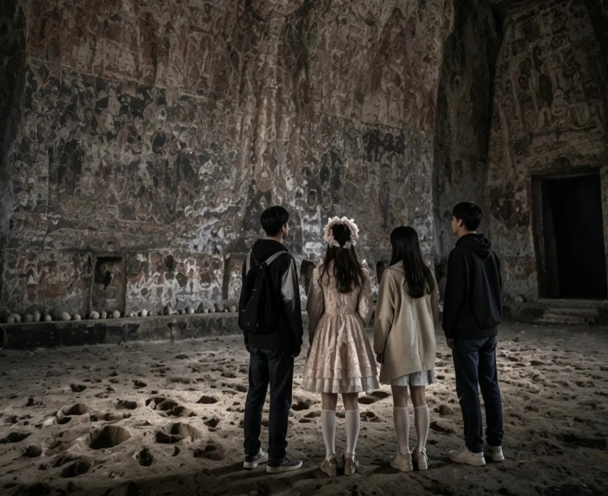

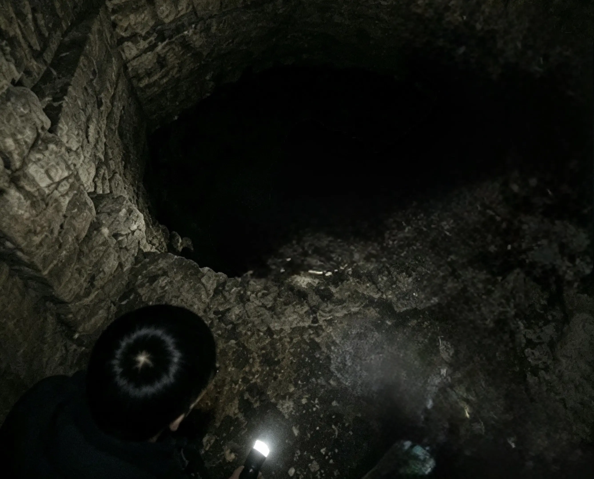

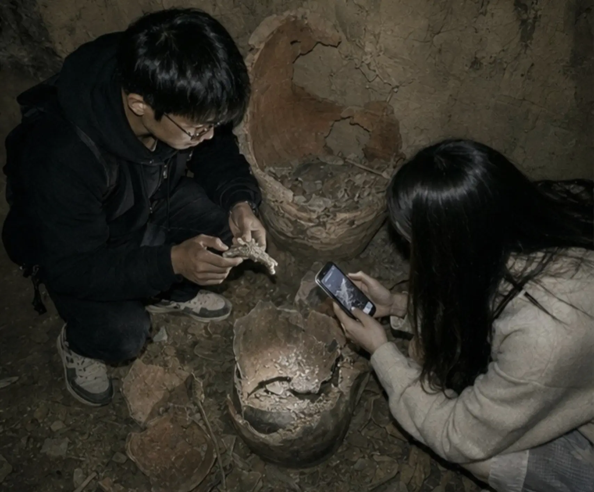

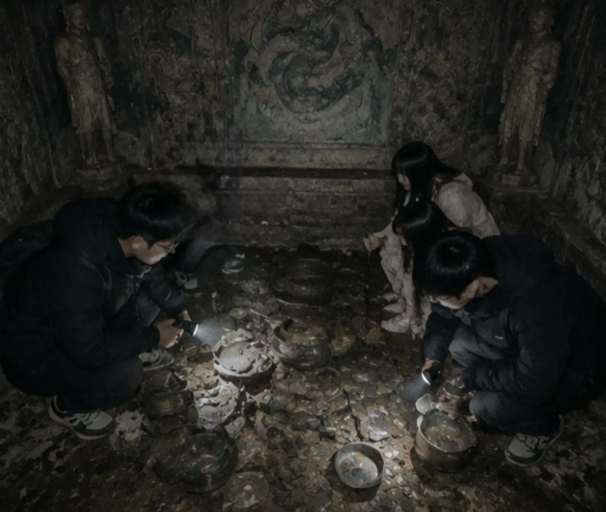

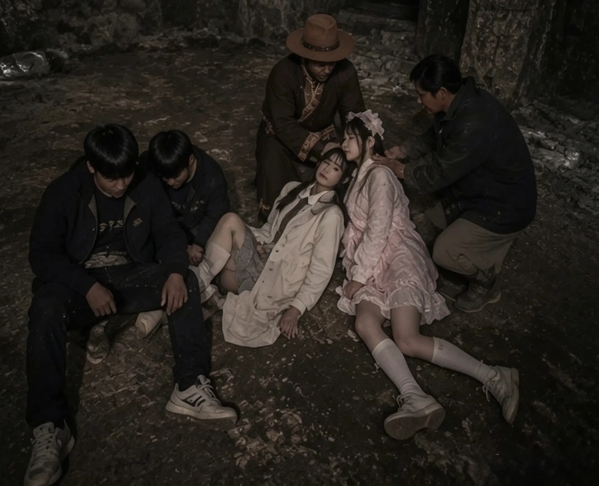

作者: [L-Ruins](https://www.douyin.com/user/MS4wLjABAAAAA5z4uipVWLok0v7E5SIXlcTgBbwDLpBji06mKzQFmMI)

发布时间：2026-7-14 12:0:0

收集时间：2026-7-21 10:5:25

统计信息：点赞数（309），评论数（5），收藏数（47），分享数（22） 

原文地址：[和三个朋友相约去西藏游玩沿途风光平和治愈，一路拍照说笑，满心期待山野美景。 与当地村民畅聊时，无意听...](https://www.douyin.com/note/7662193135594106458) 

