[toc]

# 正文

四个大学生深入偏僻深山古寨采风纪实，村里村民表面淳朴热情，待客温柔，让我们彻底放下防备。
白天我们拍摄古寨吊脚楼、记录民俗旧习，听老人讲述当地古老传说，其中最禁忌的，就是寨里世代流传的情蛊。老人再三告诫我们，外来男生千万不要随意接村民的红线、糯米酒，一旦沾染，蛊虫入体，再也离不开古寨。
我们只当是老一辈的迷信传说，一笑置之。
可诡异的事，当晚就发生在了同行男生身上。
夜里大雾锁山，寨子灯火昏暗，男生莫名高烧不退、精神恍惚，眼神呆滞、自言自语，整个人状态极其诡异。我们惊恐发现，他手腕莫名多了一根村民系的红绳，怎么都解不干净。
我们瞬间想起情蛊传说——中蛊之人，会心神被摄、执念留寨，一旦执意离开，就会备受反噬。
此刻我们才彻底后怕，所谓村民的热情好客，根本不是善意，而是在挑选外来人养蛊留寨。
我们不敢多留，连夜带着意识模糊的同伴，不顾一切逃离深山古寨。
直到顺利出山，同伴状态才慢慢好转。
这趟惊魂经历让我彻底明白：深山封闭古村的温柔表象之下，藏着外人永远不懂的禁忌与恐怖。未知的偏远村寨，永远不要轻易踏足。
#情蛊惊魂 #深山古寨诡异经历 #真实民俗故事 #大学生探险纪实 #悬疑故事

%

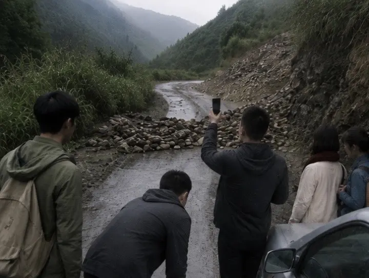

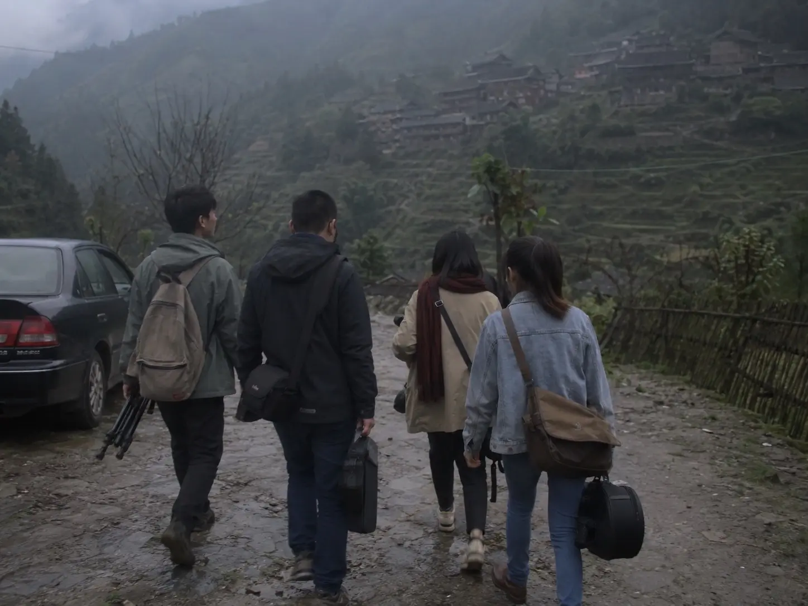

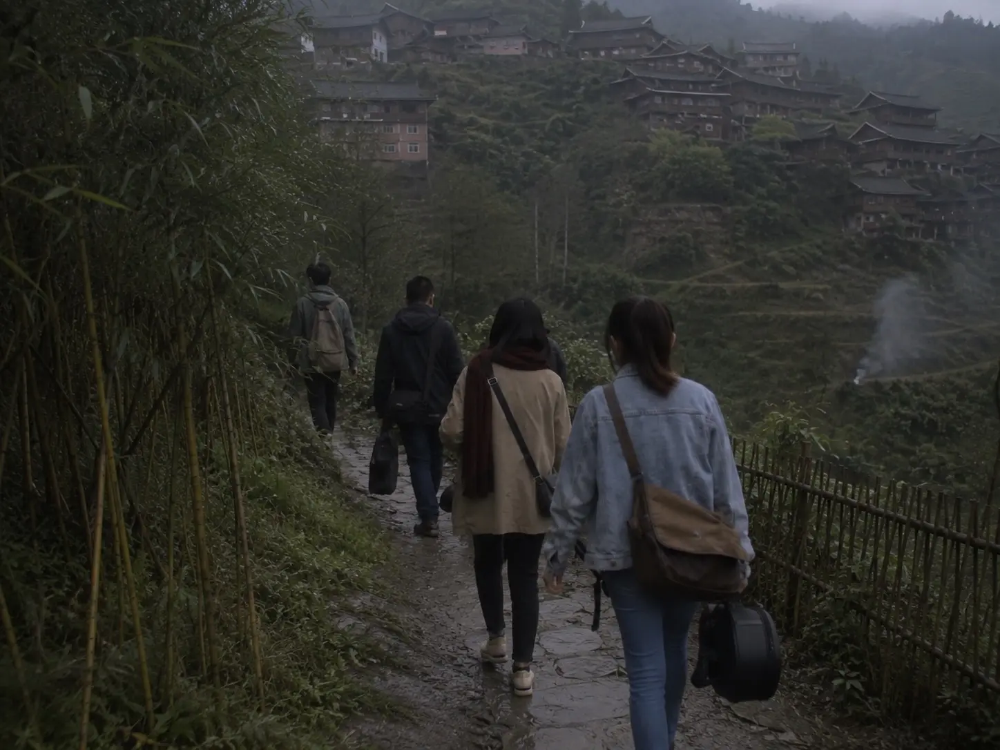

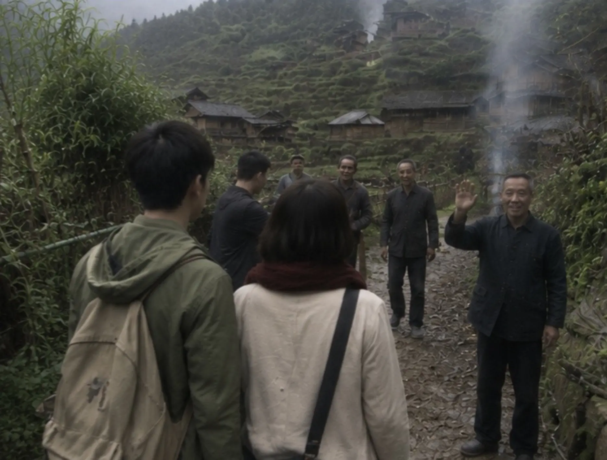

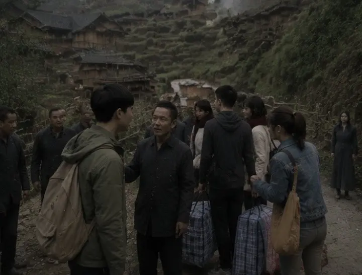

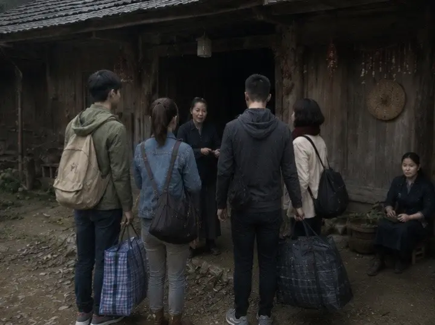

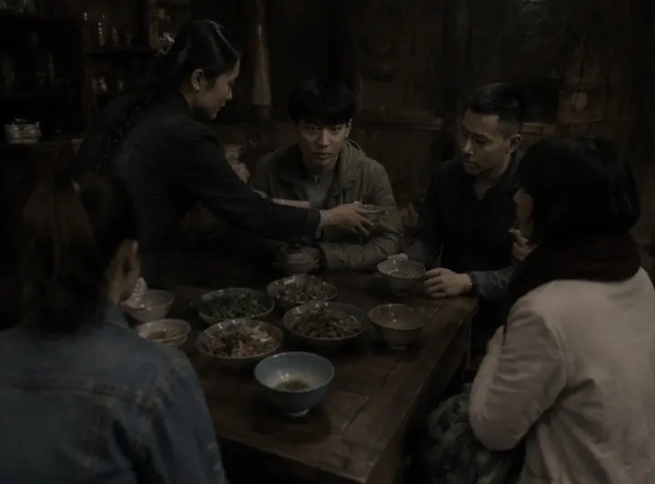

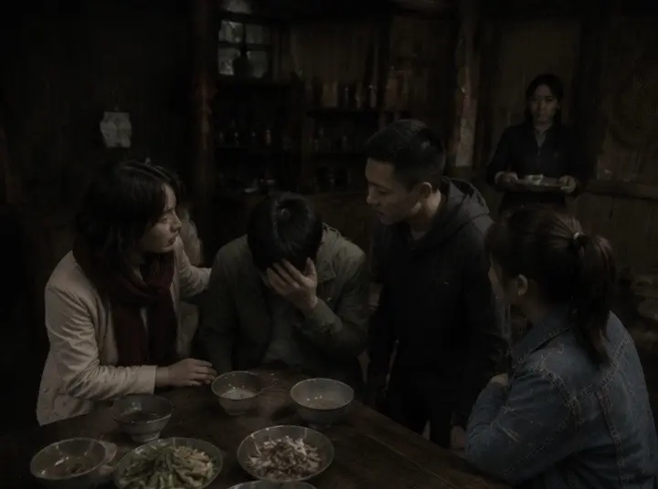

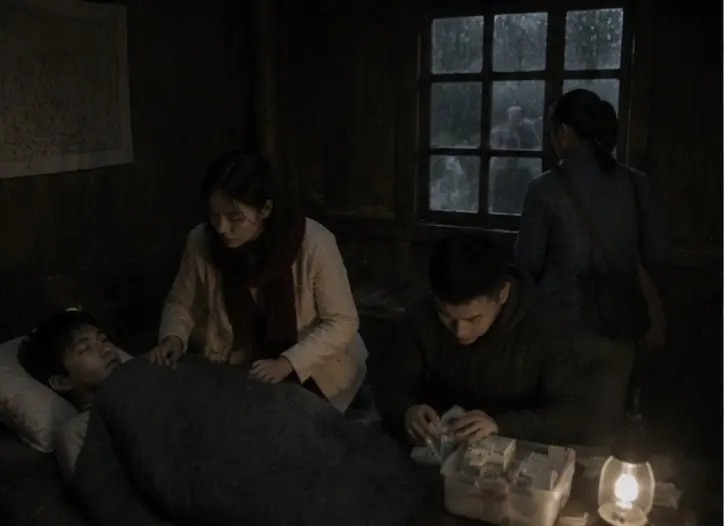

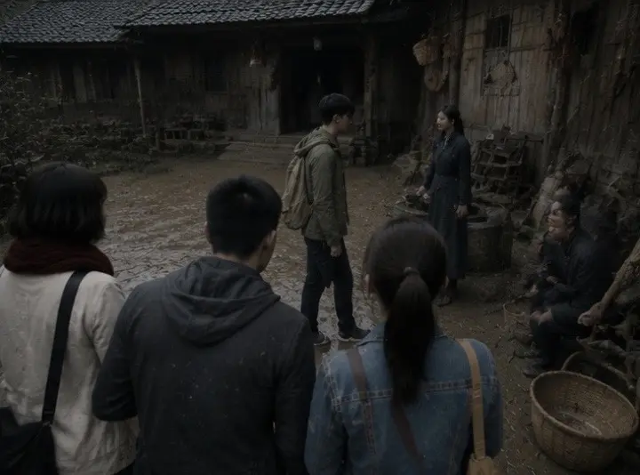

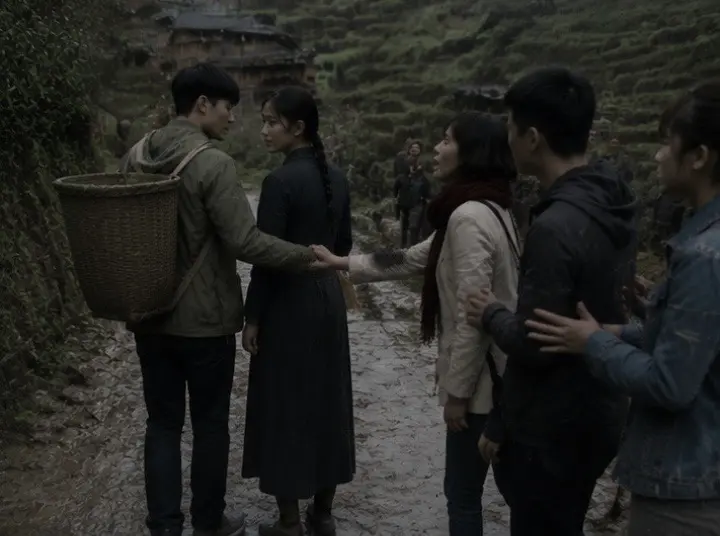

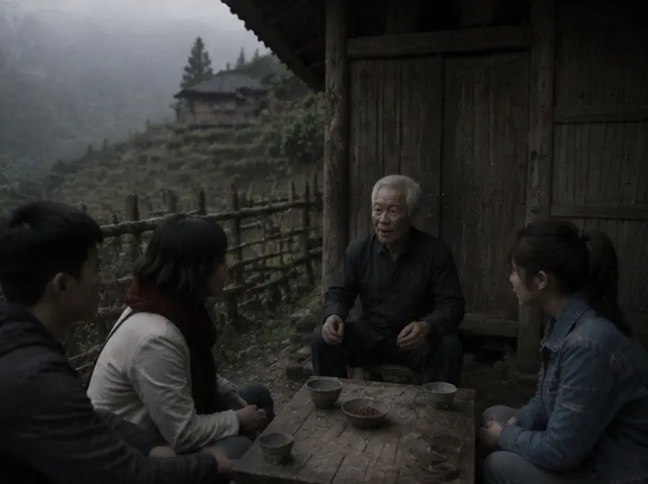

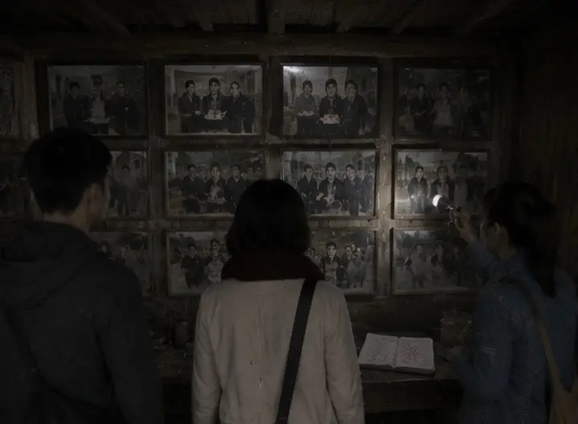

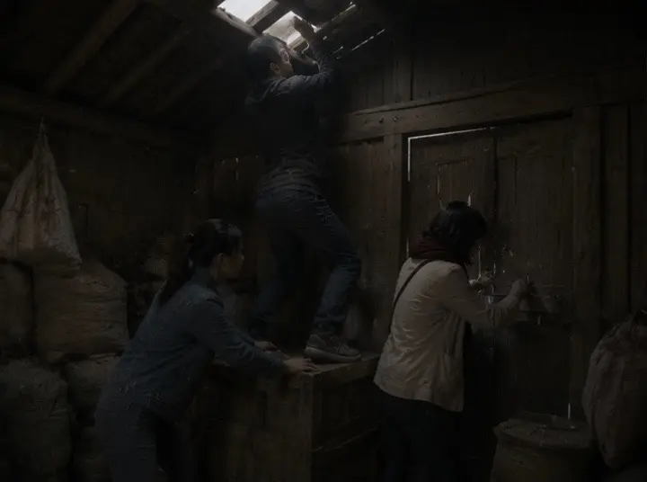

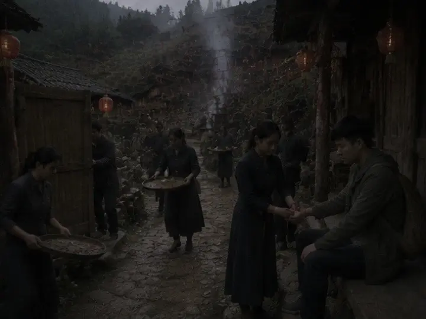

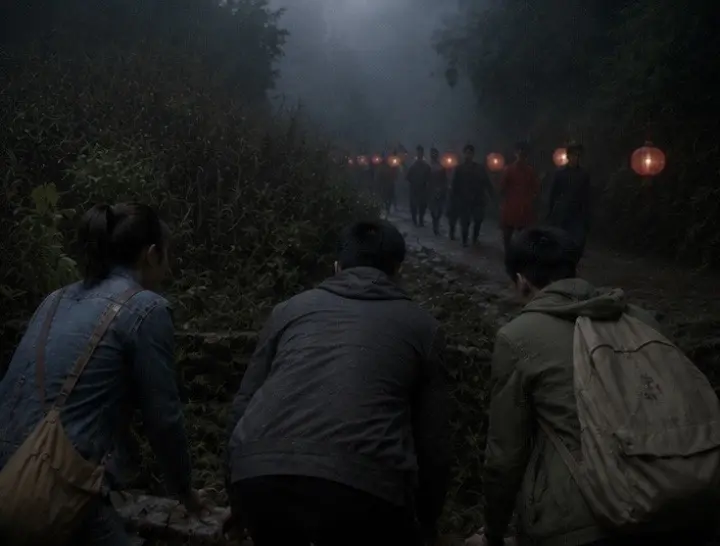

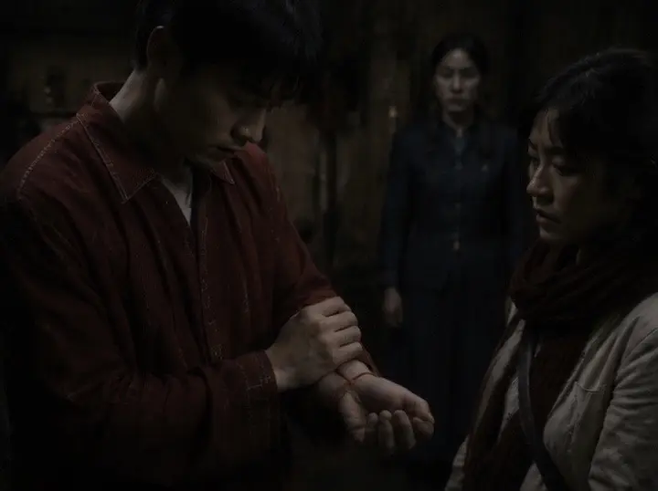

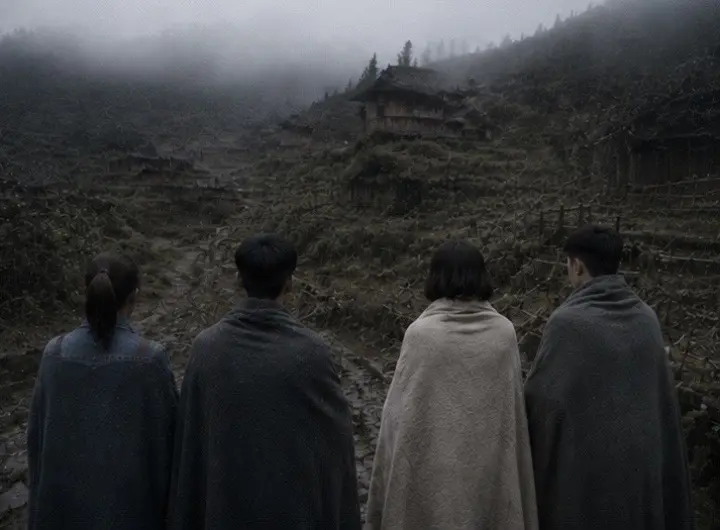

作者: [L-Ruins](https://www.douyin.com/user/MS4wLjABAAAAA5z4uipVWLok0v7E5SIXlcTgBbwDLpBji06mKzQFmMI)

发布时间：2026-7-26 6:0:0

收集时间：2026-7-29 20:46:58

统计信息：点赞数（413），评论数（3），收藏数（94），分享数（47） 

原文地址：[四个大学生深入偏僻深山古寨采风纪实，村里村民表面淳朴热情，待客温柔，让我们彻底放下防备。 白天我们拍...](https://www.douyin.com/note/7666426547171881610) 

