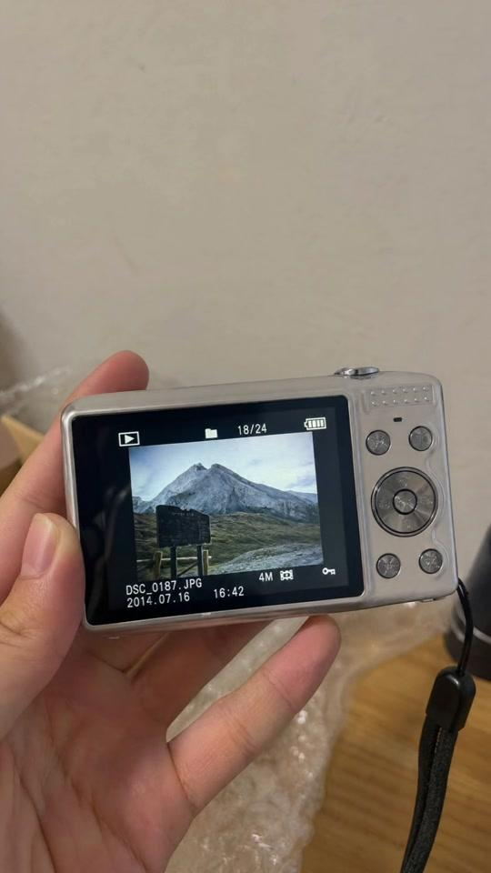
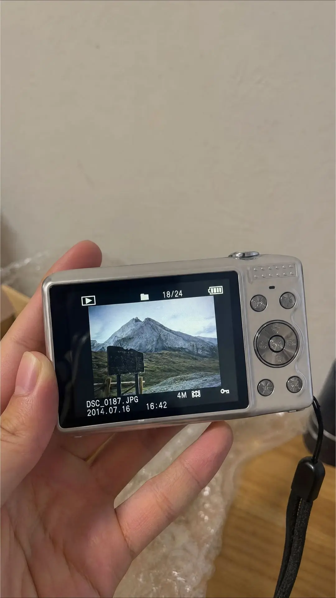
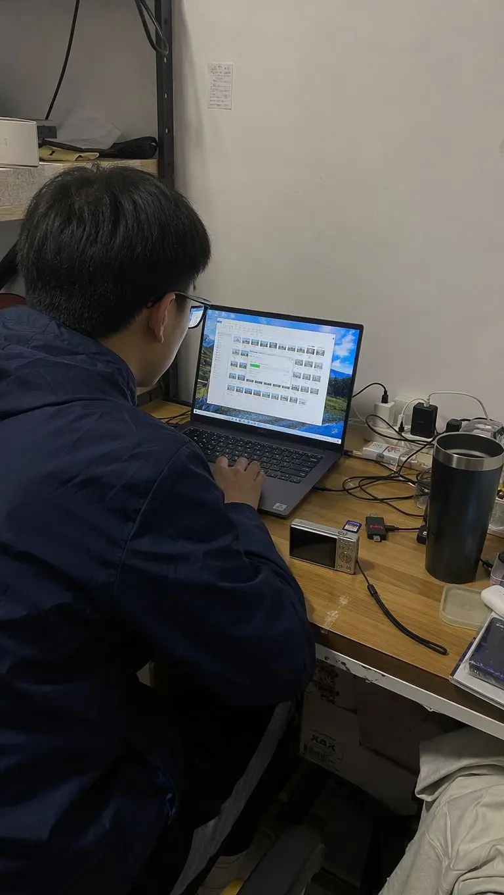
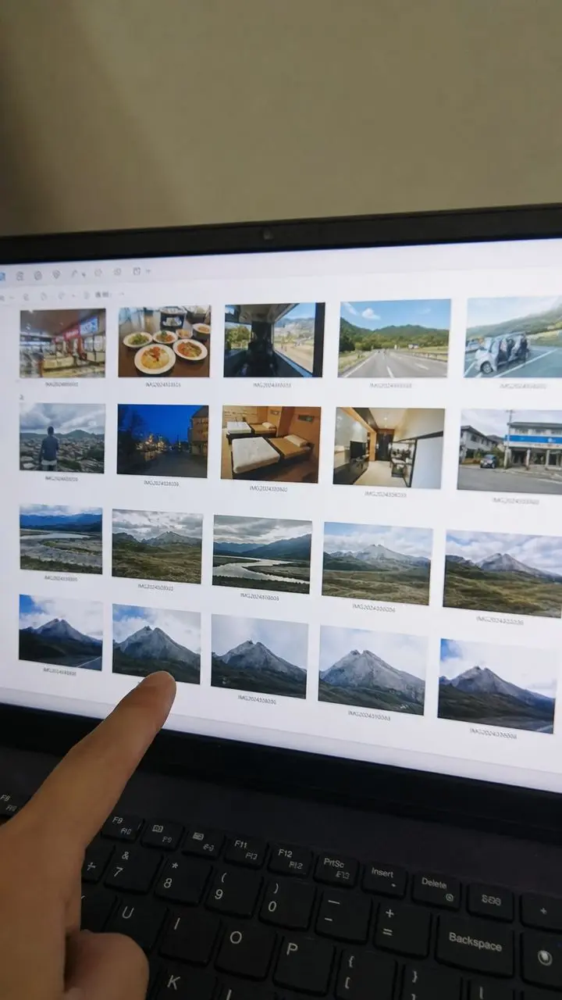
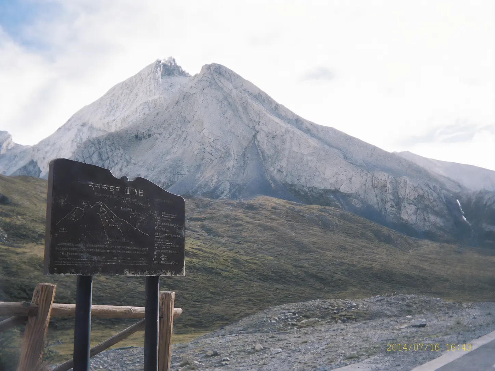

[toc]

# 正文

大学毕业后，我为了记录毕业旅行，特意买了一台二手CCD。
卖家没有清空存储卡。前面的照片都是很普通的旅行记录，只有最后几张，反复拍摄着同一座灰白色的山。
我们本来认不出那是什么地方，直到程浩注意到照片里的一块旧路牌。那个观景点，刚好就在我们的旅行路线附近。
我们决定顺路过去看看。
到达以后，我们不仅找到了照片中的山，还发现山体上有一处不断反光的亮点。走近后才看清，那是一道可以让成年人侧身通过的透光石缝。
石缝里面越来越深，岩壁上也开始出现无法解释的人工痕迹。
可真正不对劲的，是出口外面的阳光。
以及我们回头时，看见的那座山……
（本作品为架空故事，人物、地点及事件均为虚构，画面由AI辅助制作，含有超自然元素，请谨慎理性观看，请勿模仿危险户外探险行为）
#香巴拉 #探险 #秘境 #未知世界 #西藏旅行途中

%

%

%

%

%

作者: [浮光纪事](https://www.douyin.com/user/MS4wLjABAAAA4334D3TJXyeiMgnH6o-kPfj4FrNcsDCpcRzcsPctIUHriVrUhdqvILGqxVhUPV3X)

发布时间：2026-7-23 12:26:46

收集时间：2026-7-29 17:49:54

统计信息：点赞数（84199），评论数（1135），收藏数（5938），分享数（15558） 

原文地址：[大学毕业后，我为了记录毕业旅行，特意买了一台二手CCD。 卖家没有清空存储卡。前面的照片都是很普通的...](https://www.douyin.com/note/7665575190612800483) 

