[toc]

# 正文

寒假我独自去北方乡下外婆家过年，村里老人代代都念叨一句童谣：红眼绿鼻子，四个毛蹄子；走路啪啪响，专抓夜里独自出门的娃娃，它叫老毛猴
我是大学生，只当是老一辈哄小孩听话的吓唬话，从来没放在心上。外婆千叮咛万嘱咐，入夜后千万别单独去村外的枯树林，老毛猴就藏在树影里，可我总觉得太过夸张。
一天夜里，我耳机没电，独自出门去村口小卖部买电池，外头月光被厚云遮住，四下黑漆漆的，地上冻硬的枯枝被踩得咯吱响。
刚走到枯树林边缘，远处传来沉重的“啪啪、啪啪”脚步声，厚重蹄子砸在冻土上，节奏又慢又沉。
我下意识往声源看去，树林阴影里钻出来一个巨大的黑影。
它身形半人半兽，浑身长满灰黑粗长毛，四只粗壮带毛的蹄子踩在地上，正是童谣里说的四个毛蹄子。
等它往前挪两步，借着微弱天光，我看清了它的脸：鼻子泛着诡异青绿色，一双竖瞳通红发亮，满满戾气，完美对上那句红眼绿鼻子。
我双腿瞬间僵在原地，浑身血液像是冻住，不敢出声不敢跑。马虎停下脚步，脑袋微微歪着，通红的眼睛死死锁着我，鼻子不停抽动，像是在嗅活人的气息。
这时树旁窜出一只大老猫，弓起背炸毛，对着老毛猴凄厉嘶吼，不停朝黑影扔枯枝。外婆之前说过，老猫、山中天生克制老毛猴，会护住落单的人。
马虎忌惮这群野兽，迟迟不敢冲过来，沉重的啪啪脚步声来回踱步，绿光红眼始终盯着我不放。我抓住空档，拼尽全力往村里狂奔，身后的蹄声紧随不舍，直到我冲进外婆家院门，蹄声才停在远处树林边。
我浑身冷汗冲进屋，外婆见我脸色惨白，瞬间懂了发生什么。她告诉我，老毛猴是旧时山野阴物，专挑夜里独行的年轻人孩童，童谣不是玩笑，是前人留下保命警示；山林里的老猫、是唯一能制衡它的生灵。
那一晚我整夜不敢合眼，窗外时不时传来沉重的啪啪踏地声，那双发红的兽眼，还有青绿色的鼻子，到现在一想起来依旧浑身发冷。
小时候只把马虎当哄人传说，真正亲眼见到，才懂老一辈的恐惧从来都不是凭空捏造。
温馨提示：本文学故事纯属虚构，民间奇谈仅供消遣，切勿迷信，心理承受能力较弱者慎看。
#大学生乡下惊魂经历#北方民间老童谣诡事#老猫猴子克马虎#民间恐怖亲身经历#乡村诡异见闻

%

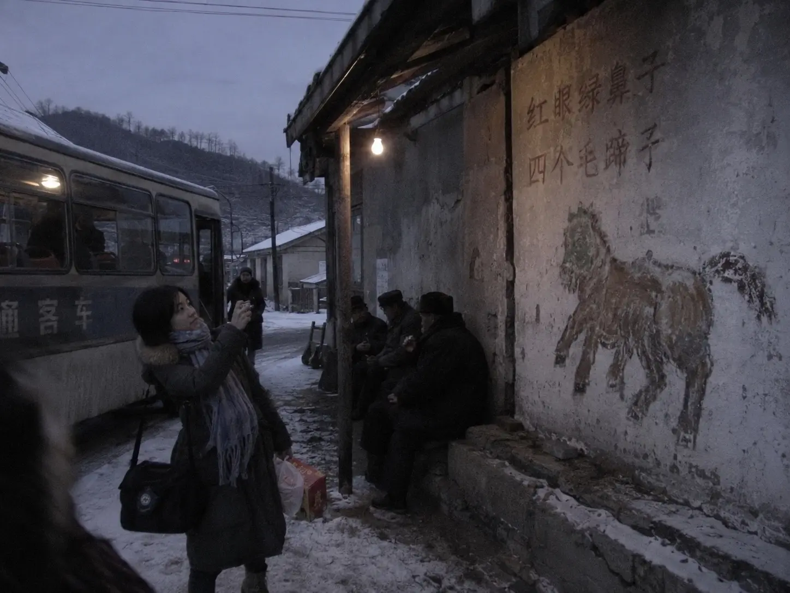

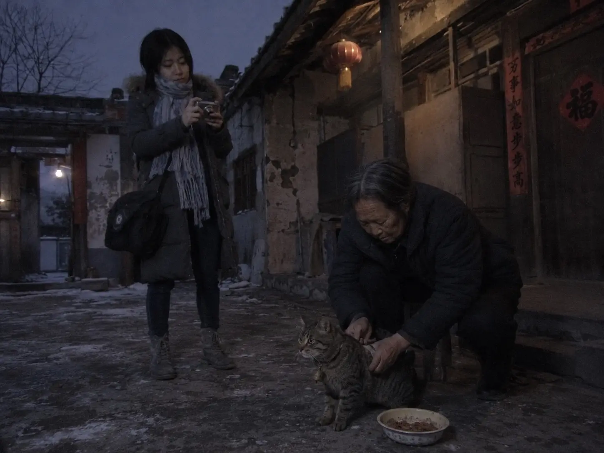

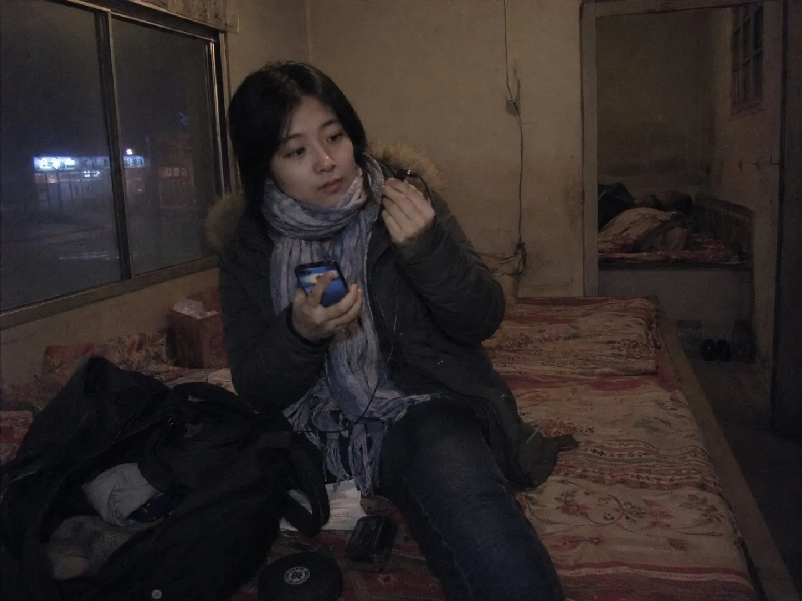

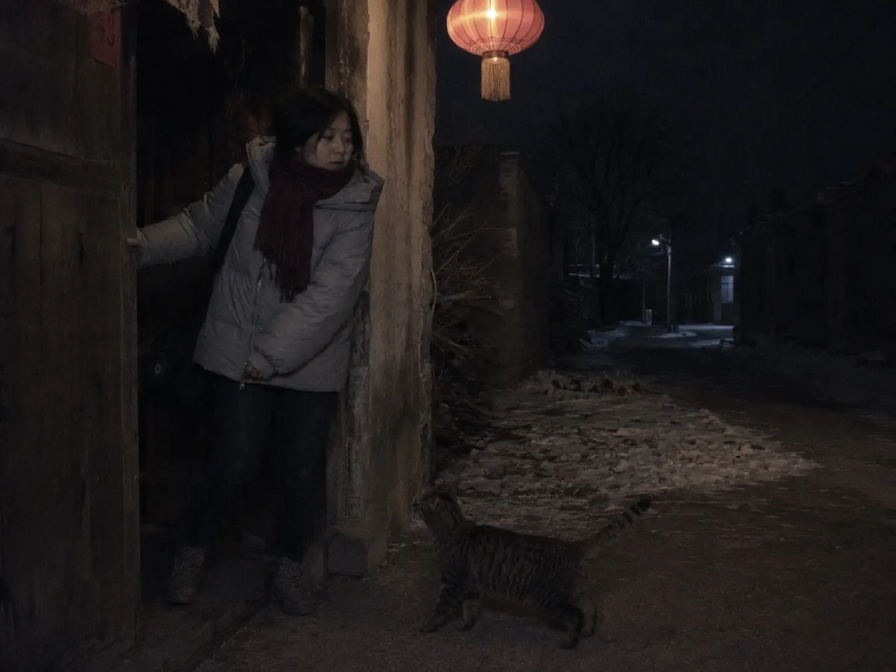

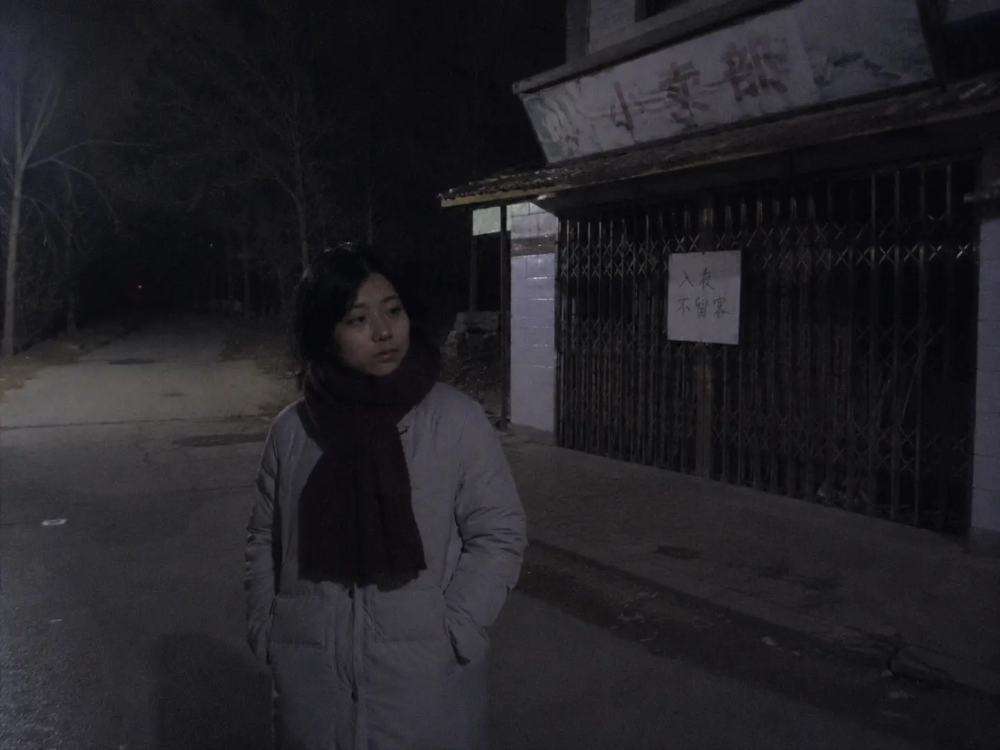

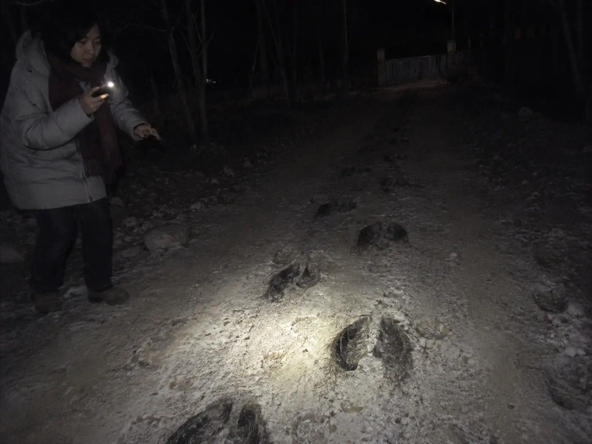

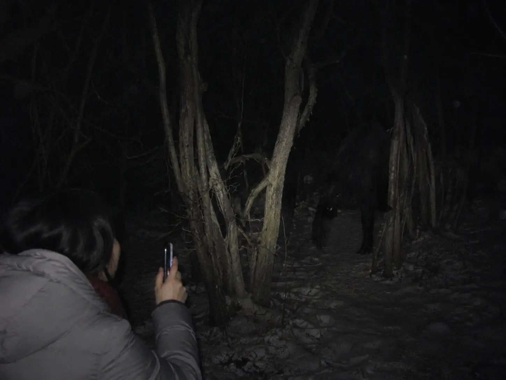

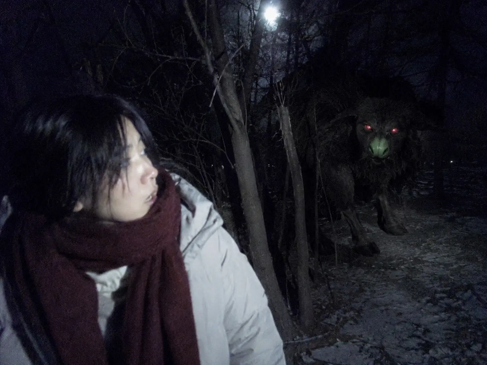

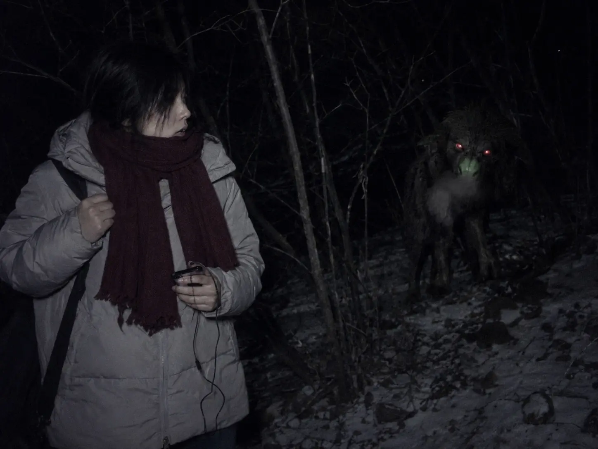

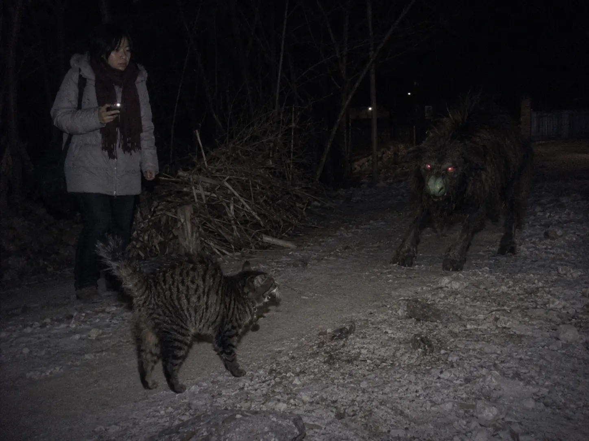

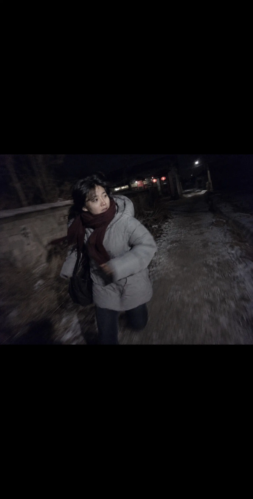

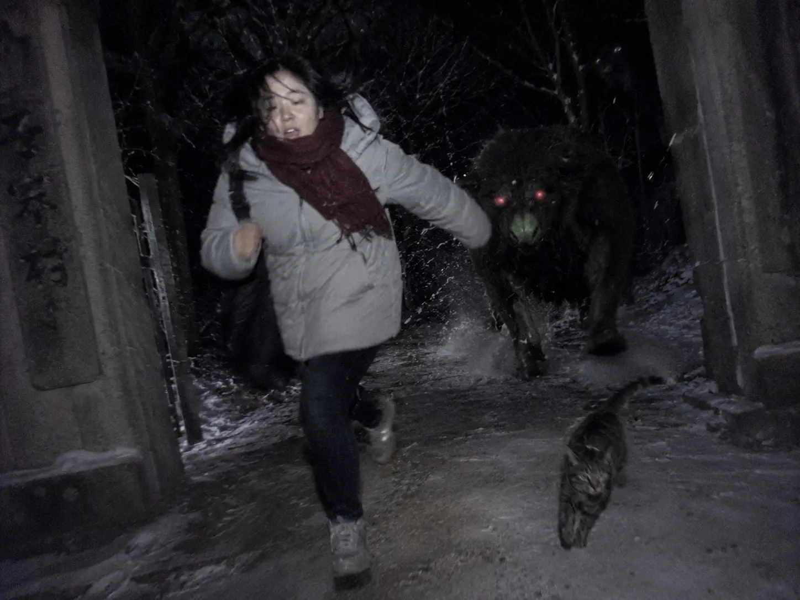

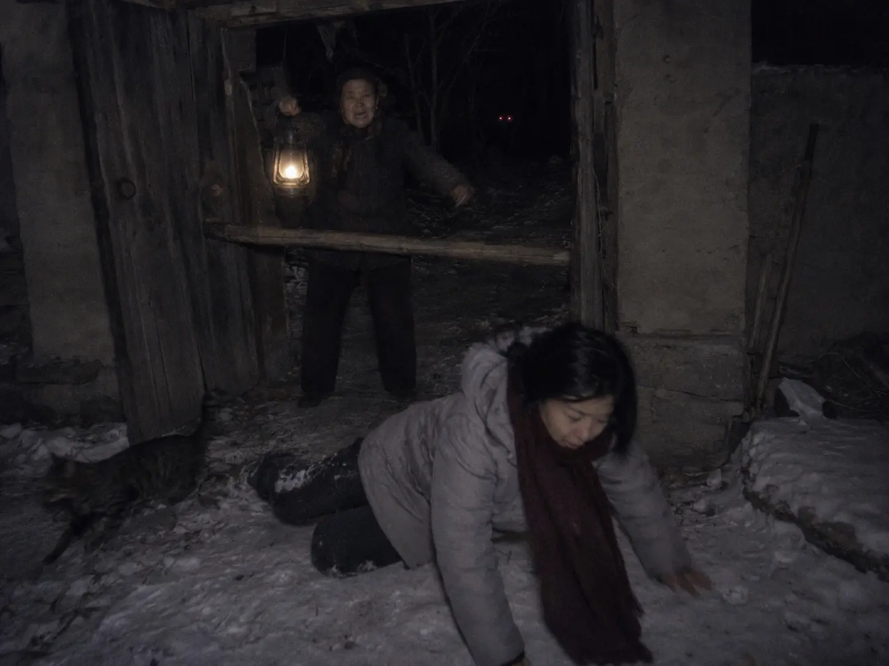

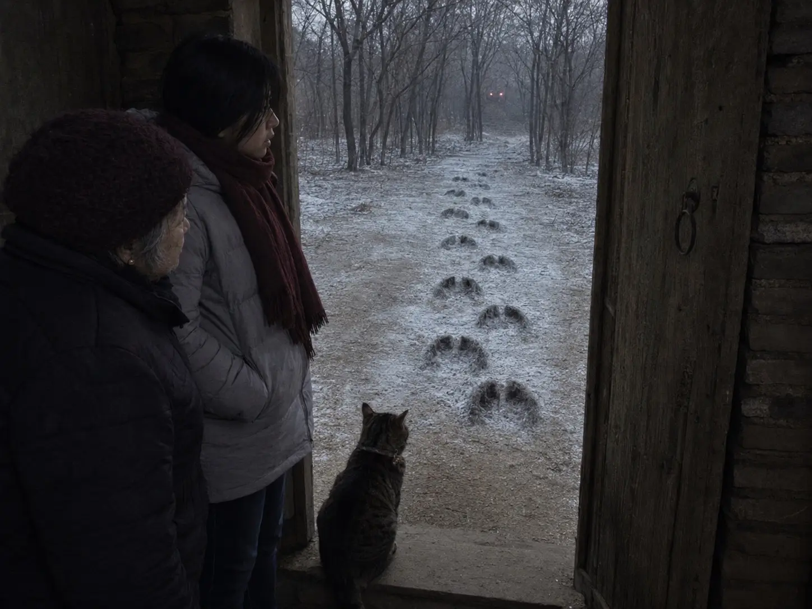

作者: [L-Ruins](https://www.douyin.com/user/MS4wLjABAAAAA5z4uipVWLok0v7E5SIXlcTgBbwDLpBji06mKzQFmMI)

发布时间：2026-7-29 12:15:24

收集时间：2026-7-29 20:59:53

统计信息：点赞数（410），评论数（16），收藏数（96），分享数（35） 

原文地址：[寒假我独自去北方乡下外婆家过年，村里老人代代都念叨一句童谣：红眼绿鼻子，四个毛蹄子；走路啪啪响，专抓...](https://www.douyin.com/note/7667798771589605851) 

