[toc]

# 正文

来自网友投稿：暑假回深山老家，我只去后山转了一圈。再回来时，老屋竟变成了荒坟。浓雾中，一群苍白身影缓缓靠近，而最前面的怪物......
温馨提示：
本内容为虚构故事与艺术化演绎，不影射真实人物或地点，不宣扬封建迷信；画面含轻微惊悚元素，胆小者谨慎观看。
#悬疑故事 #深山怪谈 #乡村怪谈 #民俗故事 #梦境故事

%

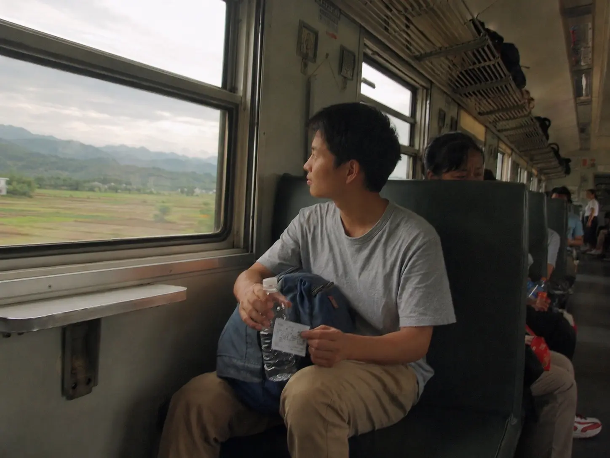

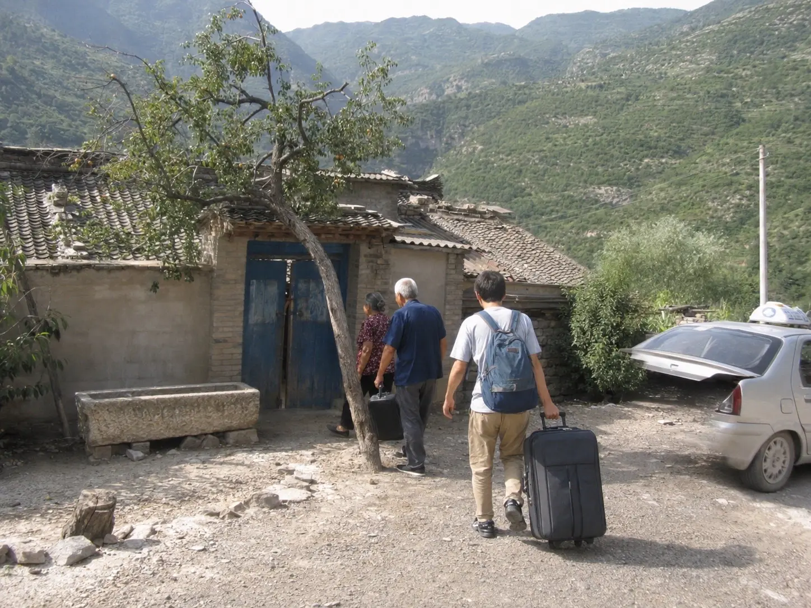

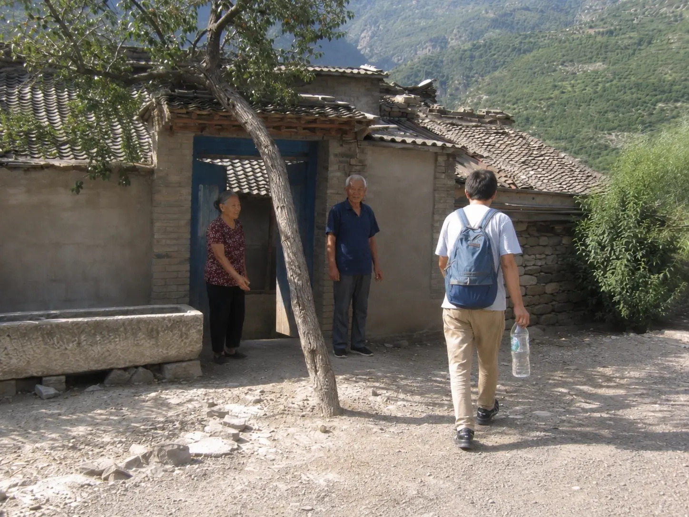

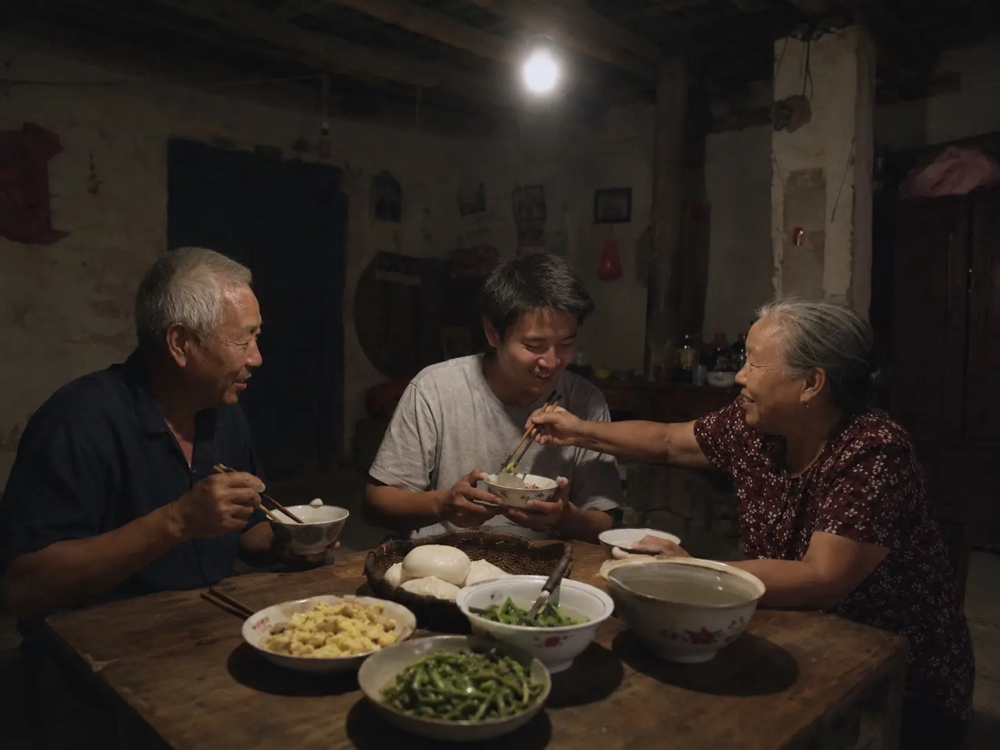

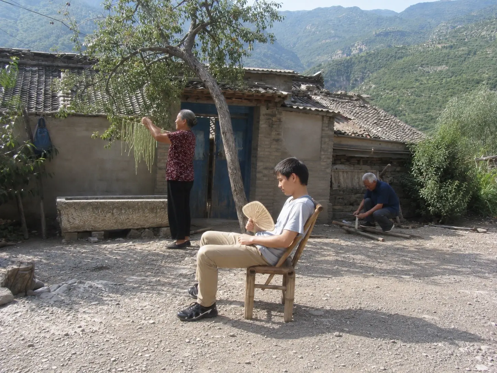

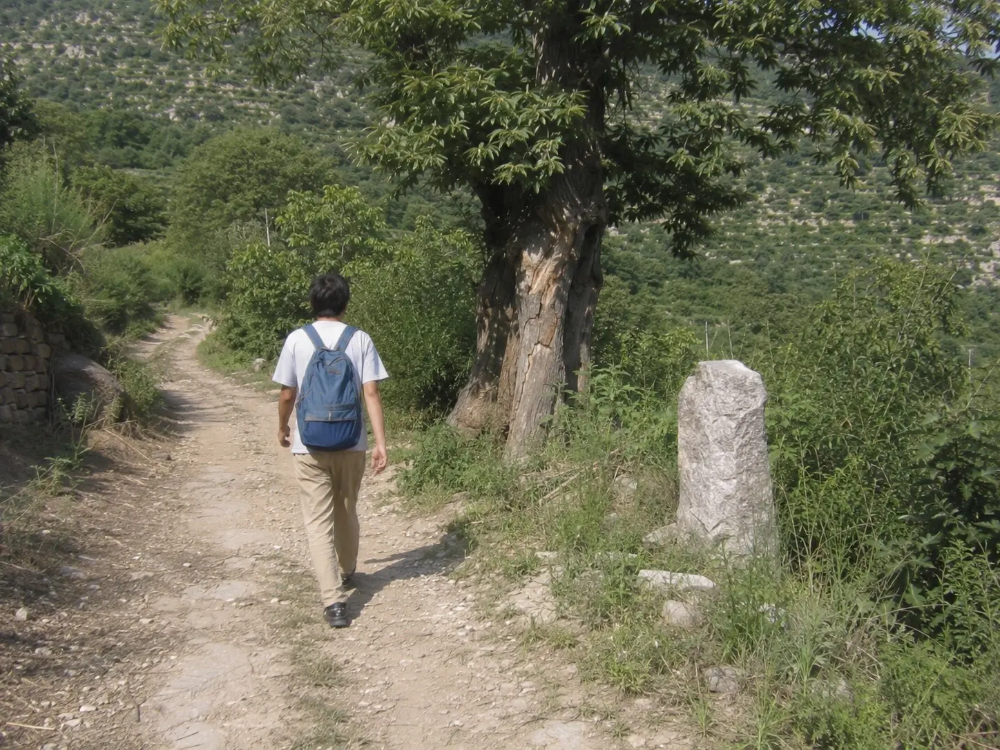

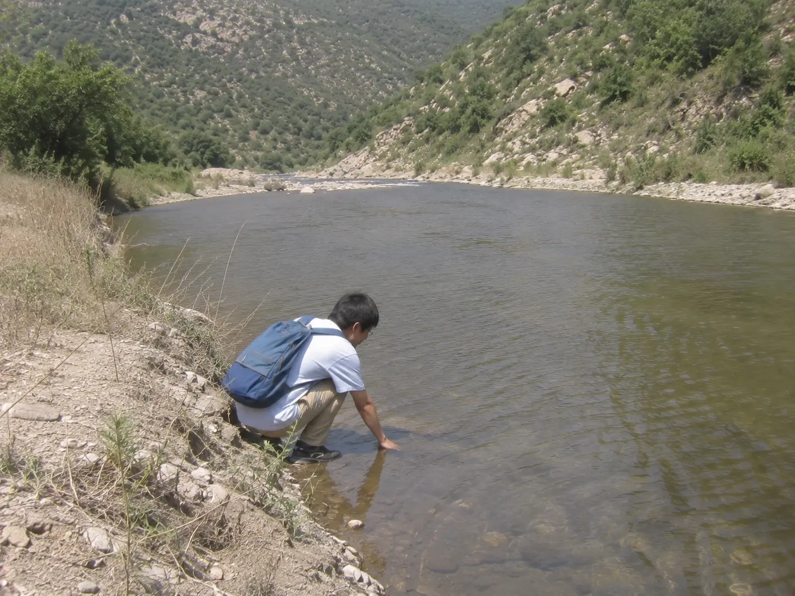

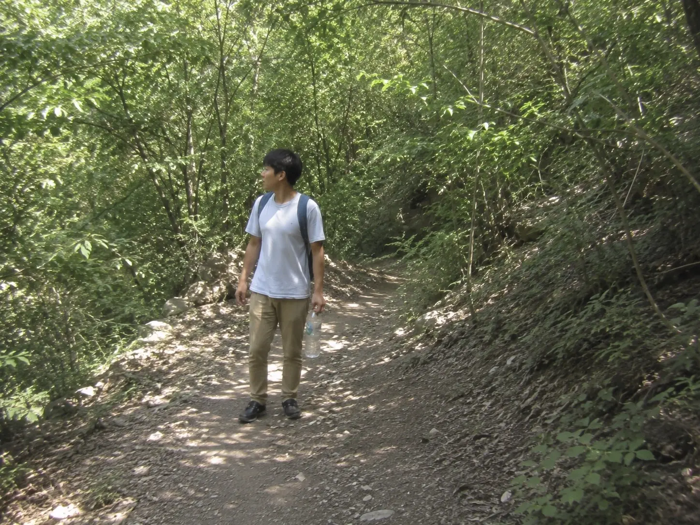

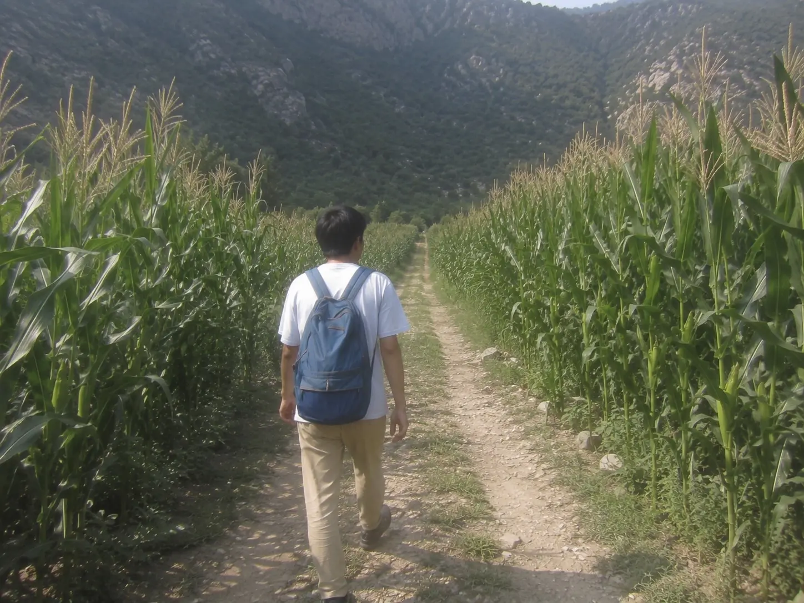

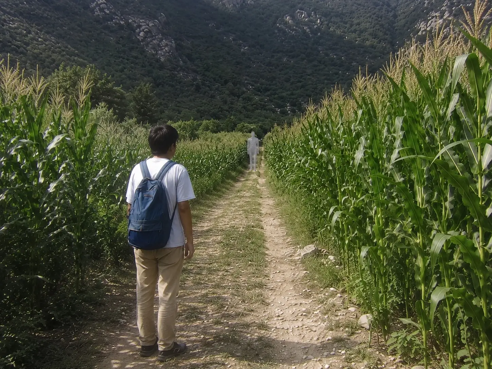

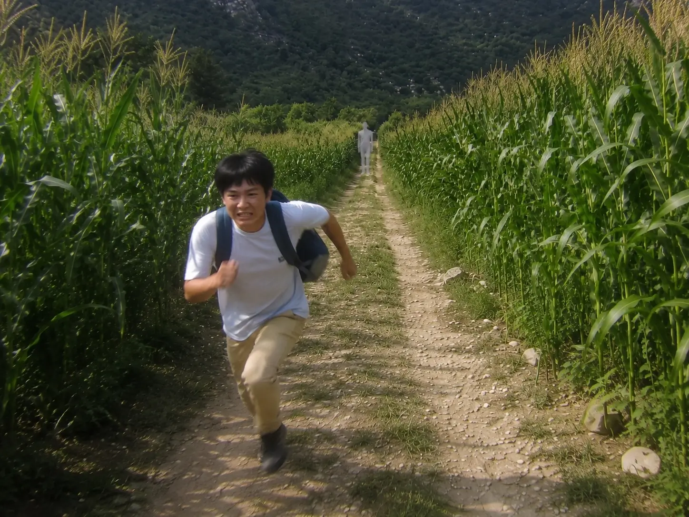

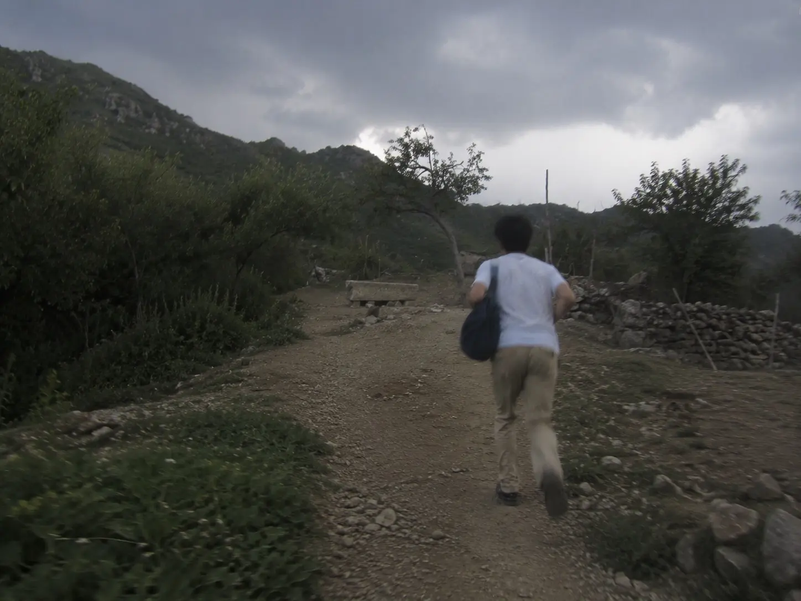

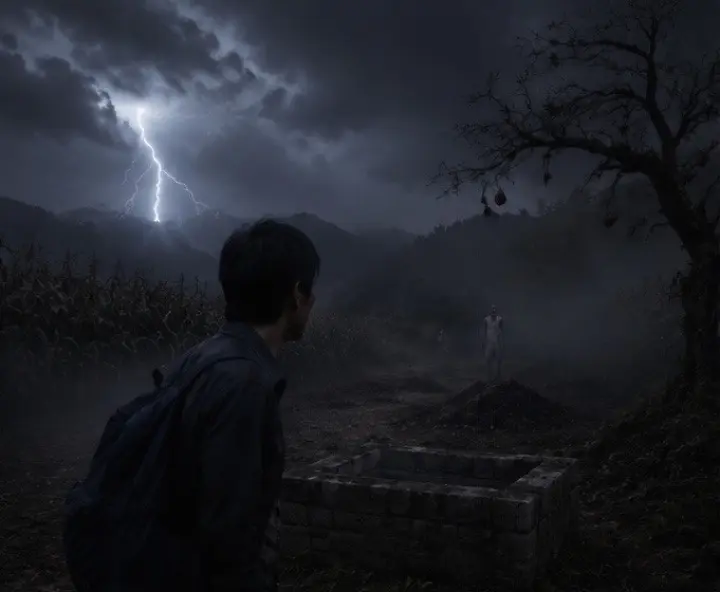

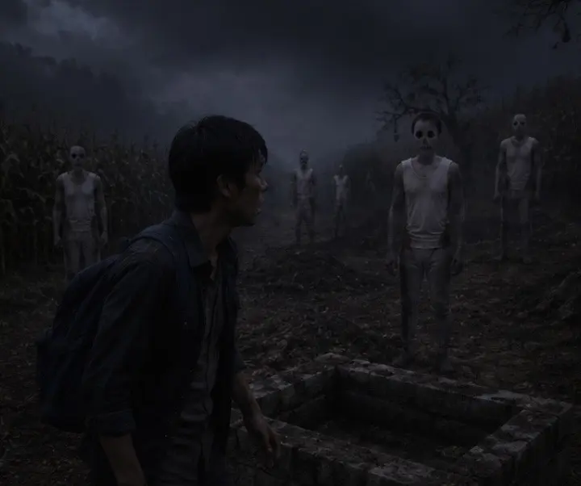

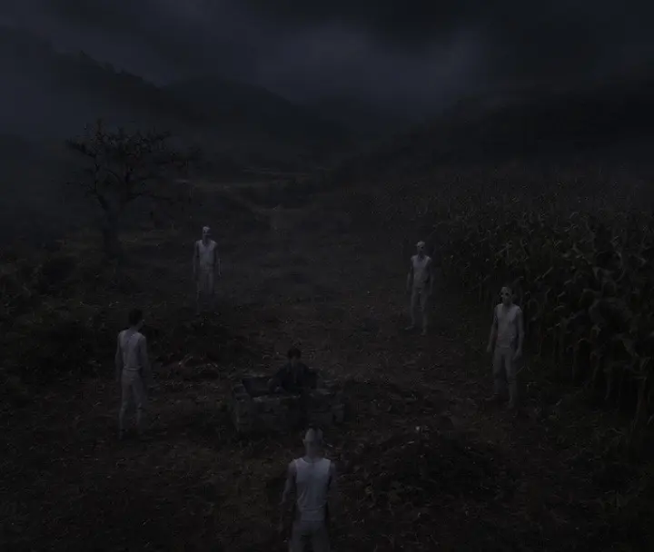

作者: [L-Ruins](https://www.douyin.com/user/MS4wLjABAAAAA5z4uipVWLok0v7E5SIXlcTgBbwDLpBji06mKzQFmMI)

发布时间：2026-7-27 11:46:14

收集时间：2026-7-29 20:56:3

统计信息：点赞数（1432），评论数（74），收藏数（418），分享数（443） 

原文地址：[来自网友投稿：暑假回深山老家，我只去后山转了一圈。再回来时，老屋竟变成了荒坟。浓雾中，一群苍白身影缓...](https://www.douyin.com/note/7667049084558016498) 

