[toc]

# 正文

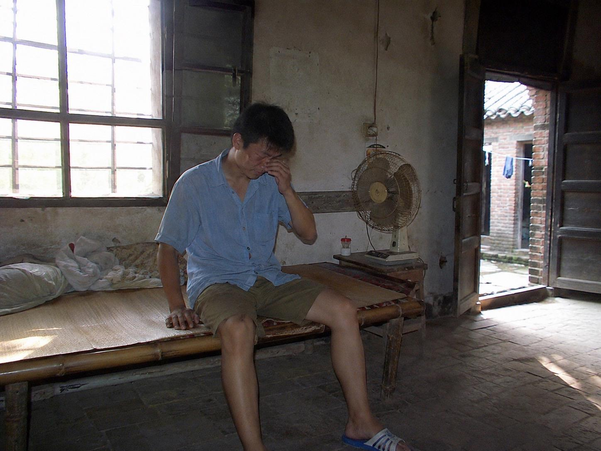

网友投稿【童年阴影】白天爷爷刚处理完一条蛇，晚上沟里就有一条“站着”等我
这件事发生在我十八岁那年
那天我在乡下老家午睡，醒来后发现爷爷奶奶正在院子里处理一条蛇。爷爷用长火钳控制住它，奶奶则在旁边帮忙。后来爷爷取出一枚墨绿色的蛇胆，说是可以“清热”，奶奶便就着水服了下去。
到了晚上，我们一家人吃完饭，我独自跑到院子旁边玩。
那里有条半米深的土沟。平时长满狗尾草，经常能听见蛐蛐叫。
可我刚走到沟边，周围突然安静了。
沟底立着一条足有一米五长的蛇。
它没有逃，也没有朝我爬过来，而是把前半截身体高高抬起，头几乎与我的胸口齐平，就那样一动不动地盯着我。
那双眼睛，根本不像普通动物的眼神。
更像是它早就知道我会过去，已经在沟里等了很久。
我吓得转身跑回院子，反复告诉爷爷：“沟里有条蛇，它站起来一直看着我！”
可他们都不相信。
直到我喊了好几遍，爷爷、奶奶和爸爸才拿着手电跟我过去。
然而手电照遍整条土沟，里面除了一只被我丢下的玻璃罐，什么都没有。
当天晚上，我做了一个特别真实的梦。
梦里，一个脸色苍白、毫无表情的女蛇精出现在床边。她上半身像女人，腰部以下却连着一条粗大的灰褐色蟒尾。她没有伤害我，只是让蟒尾沿着床铺缓慢盘绕，始终低头看着我的脸。
最让我害怕的是，这个梦并没有结束。
后面连续几个晚上，她都会出现，而且一次比一次离我更近。
我把这件事讲给家人和身边的人听，没有一个人相信。他们都说小孩子受了惊，晚上才会胡乱做梦。
可这么多年过去，我始终想不明白：
如果沟里的蛇只是我看错了，为什么接下来的几个晚上，我会反复梦见同一个女蛇精？
你们小时候，有没有见过一件直到长大都解释不了的事？
#农村怪谈 #童年阴影 #乡村往事 #真实经历改编
温馨提示：内容根据童年记忆改编，民俗情节仅用于故事表达，请勿模仿处理或食用野生动物。

%

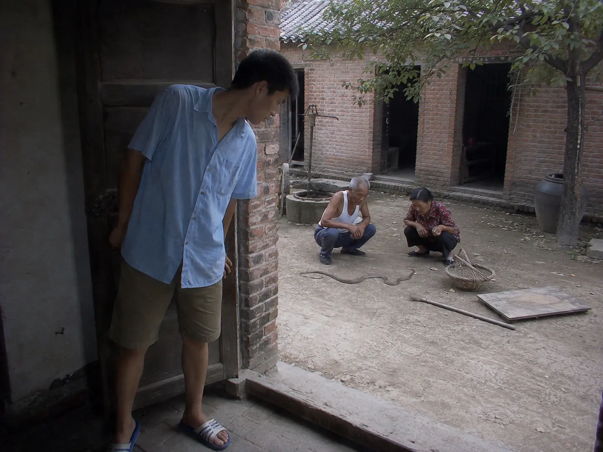

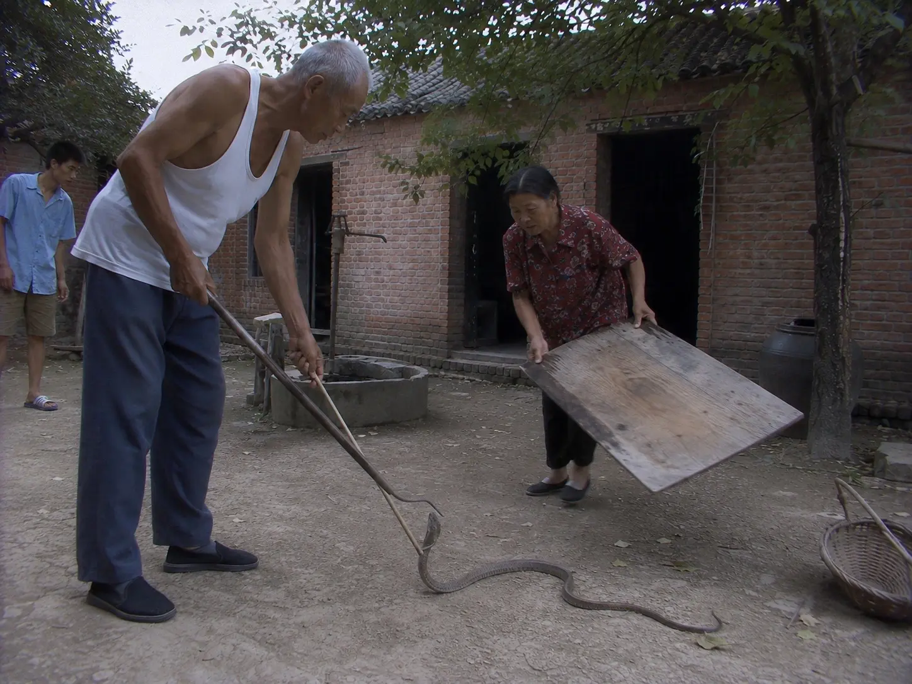

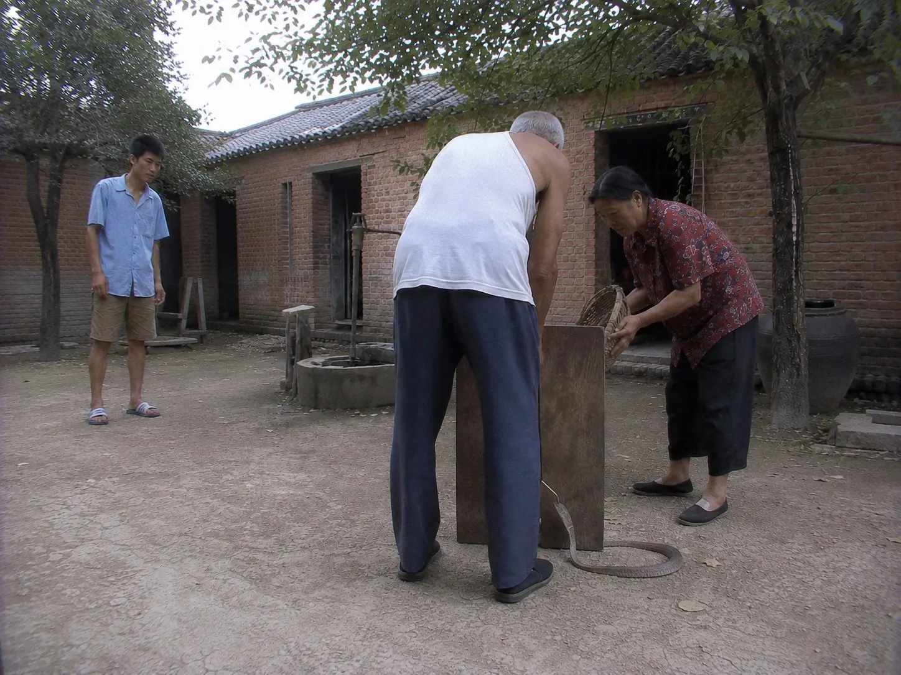

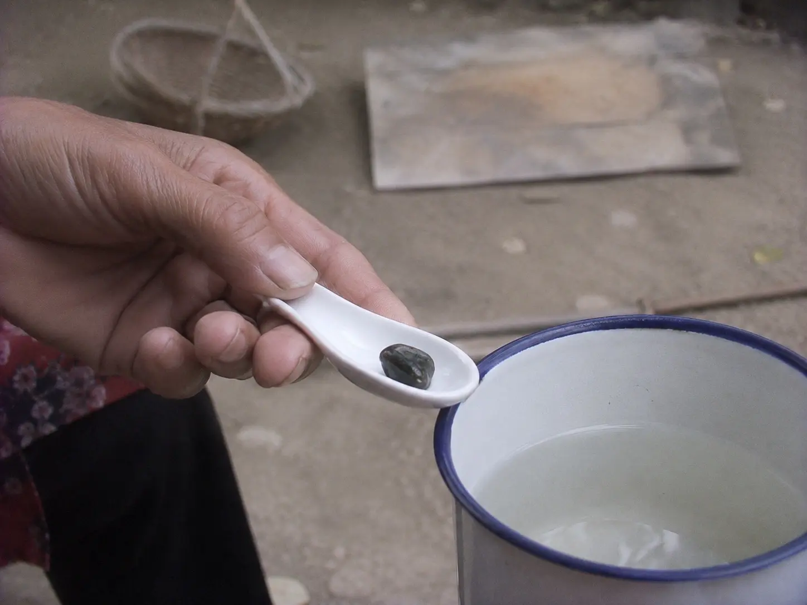

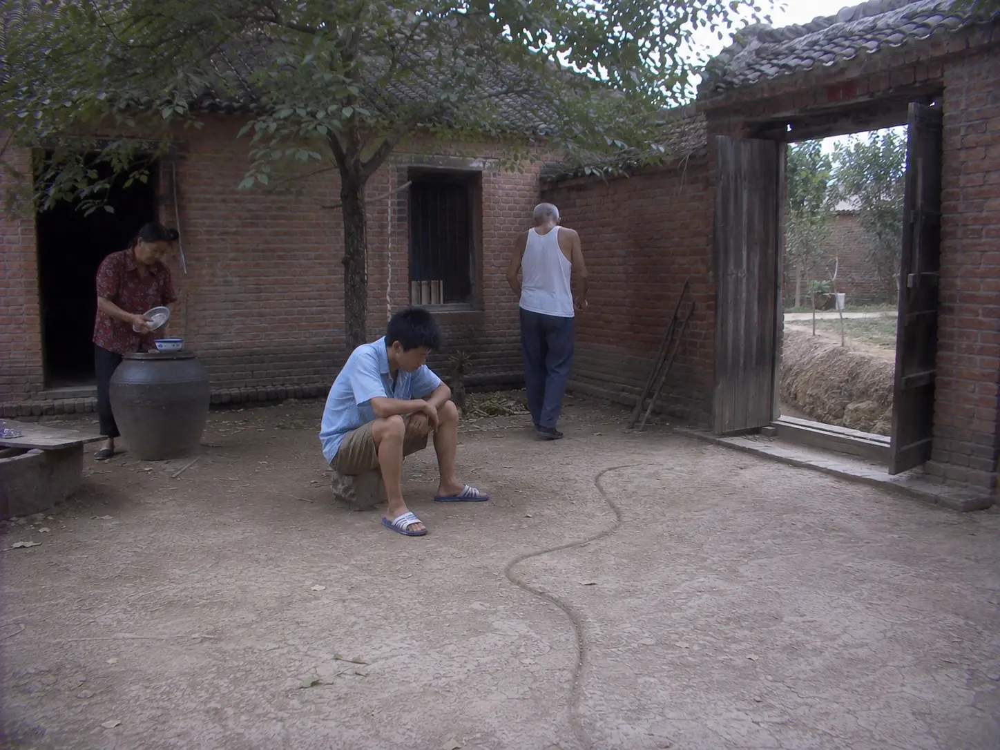

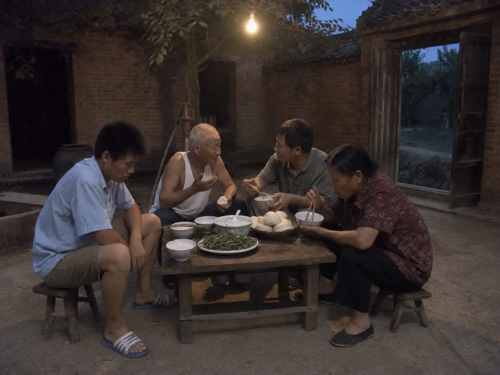

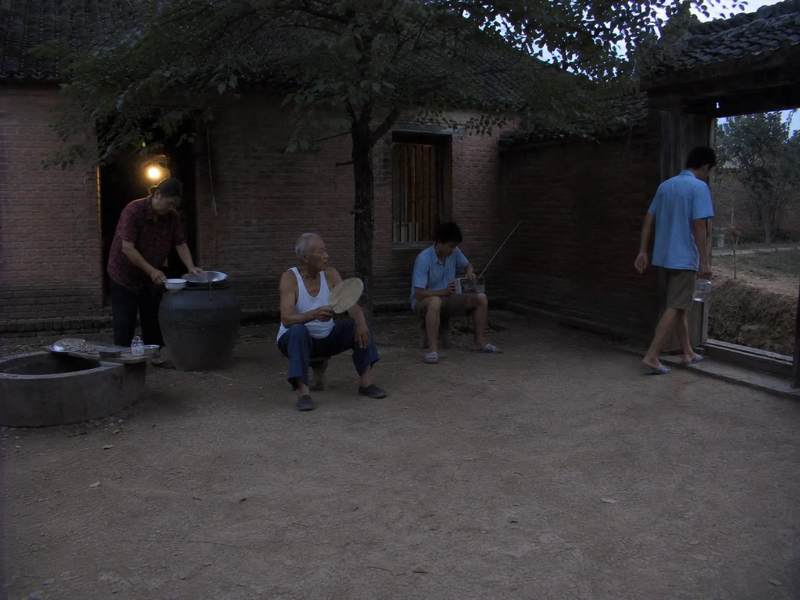

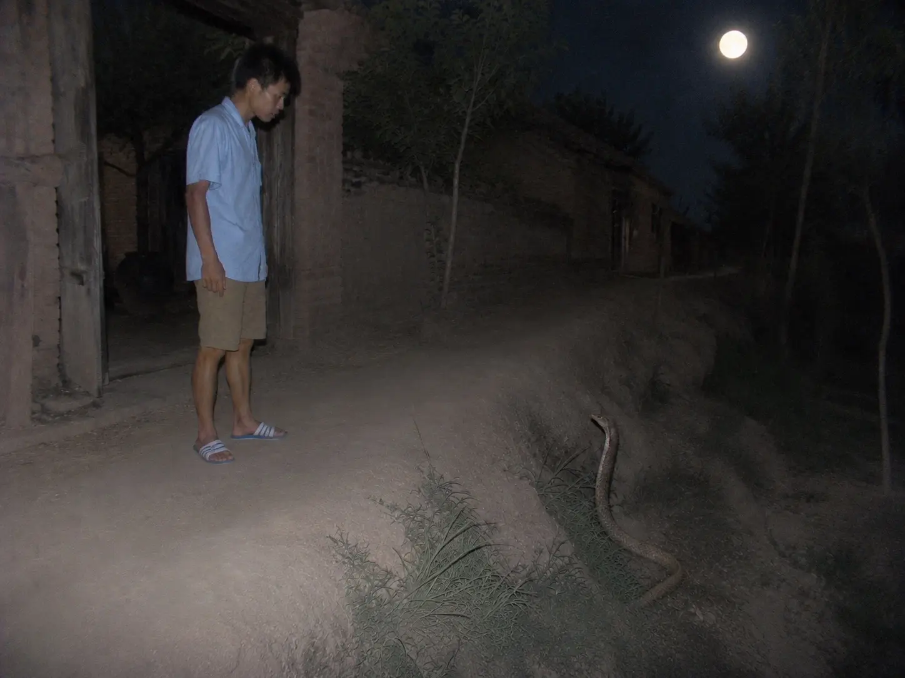

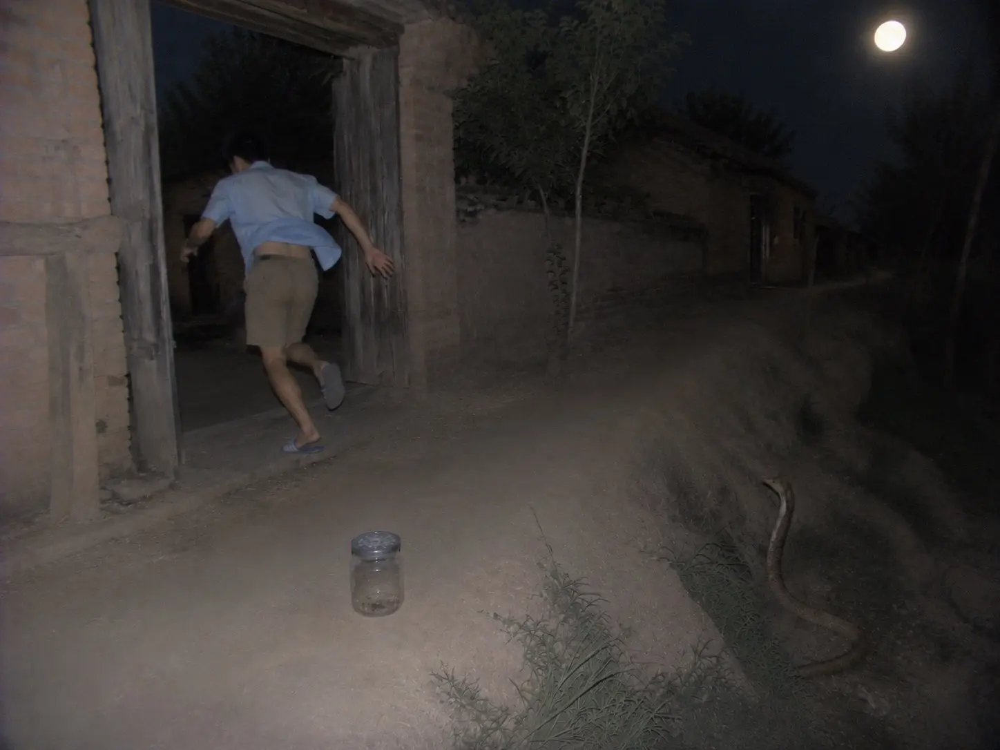

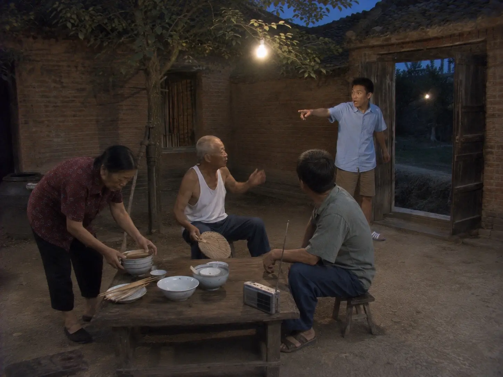

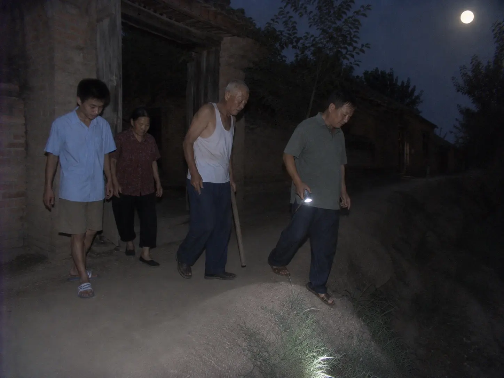

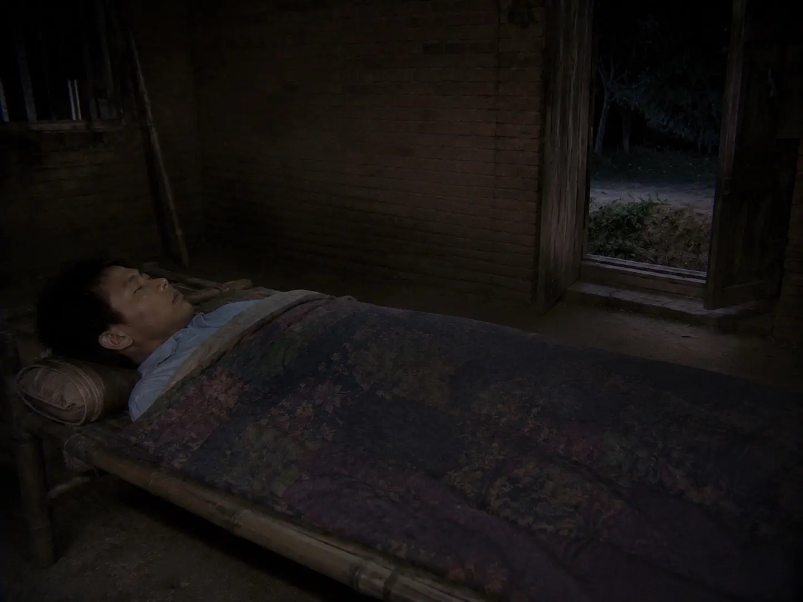

作者: [L-Ruins](https://www.douyin.com/user/MS4wLjABAAAAA5z4uipVWLok0v7E5SIXlcTgBbwDLpBji06mKzQFmMI)

发布时间：2026-7-28 10:5:54

收集时间：2026-7-29 20:58:1

统计信息：点赞数（87），评论数（6），收藏数（22），分享数（9） 

原文地址：[网友投稿【童年阴影】白天爷爷刚处理完一条蛇，晚上沟里就有一条“站着”等我 这件事发生在我十八岁那年 ...](https://www.douyin.com/note/7667394311679462857) 

