[toc]

# 正文

谁能想到一场普通的云贵散心之旅，差点让我们四个人惹上大麻烦。
我们四个老友从信阳出发，坐长途火车中转贵阳，一路翻山越岭抵达大理，特意避开商业化古城，选了安静的山间民宿落脚。
白天逛集市吃遍白族特色菜，傍晚闲来无事沿着后山小路散步，意外走进一条几乎没有游客的茶马古道。
古道幽深草木丛生，走了二十多分钟，前方两道百丈断崖形成天然石门，石壁上刻满看不懂的古老图腾。
我们抱着猎奇心态推开石门，里面竟是一处封闭千年的天然洞窟，石台上整齐堆放大量古滇国青铜、鎏金器物与玉石财宝，和史书里记载的滇王埋藏宝藏完全吻合。
短短几秒兴奋过后，恐惧瞬间淹没所有人。这些文物属于国家，私自窥探、私藏都是违法行为，洞窟偏僻无人看管，万一留下痕迹百口莫辩。
我们不敢触碰任何珍宝，关掉手电快速退出古道，冲回民宿连夜收拾行李，赶深夜火车仓促离开大理，民宿押金、预定的环海行程全部直接放弃。
本以为是治愈的大理之旅，没想到撞上消失千年古滇秘藏，连夜跑路是我们唯一的选择。
#大学生穷游#大理冷门古道 #古滇文明传说 #旅游惊险实录 #民间奇闻

%

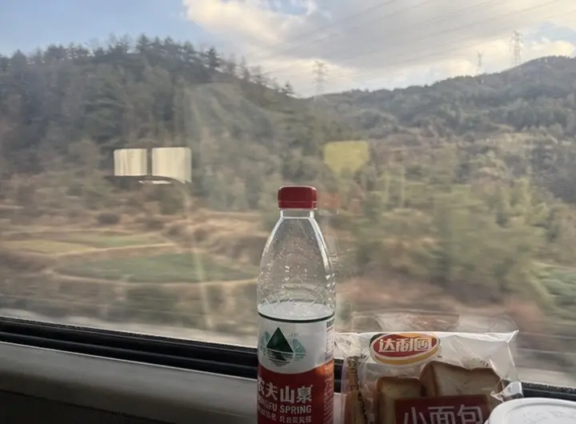

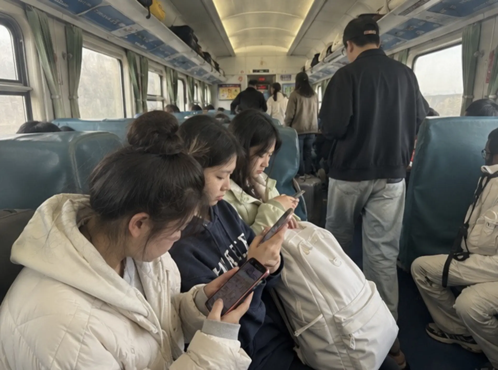

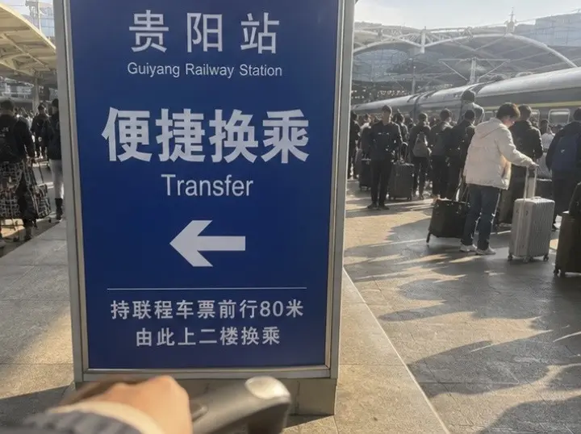

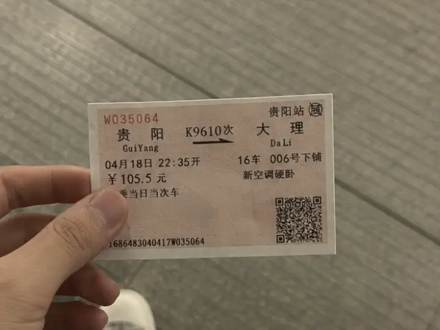

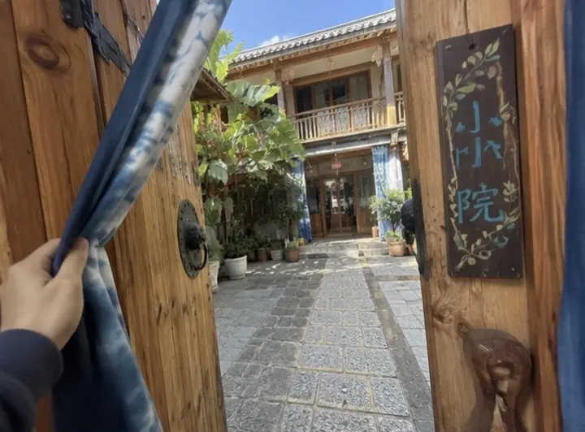

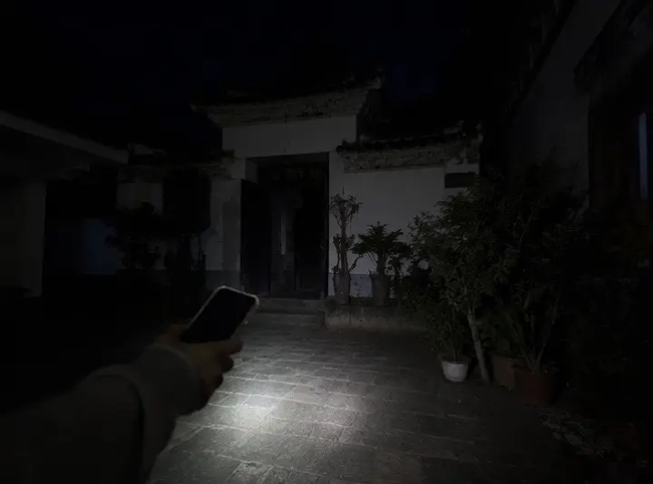

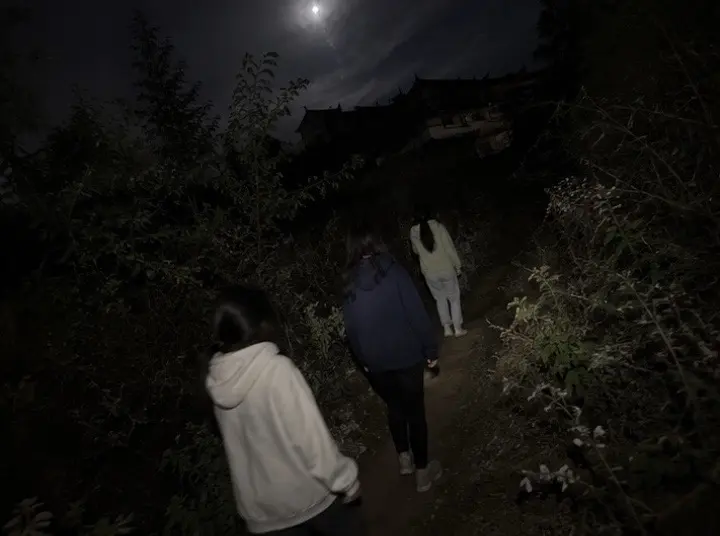

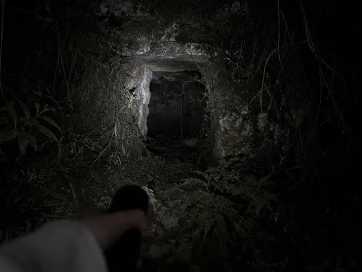

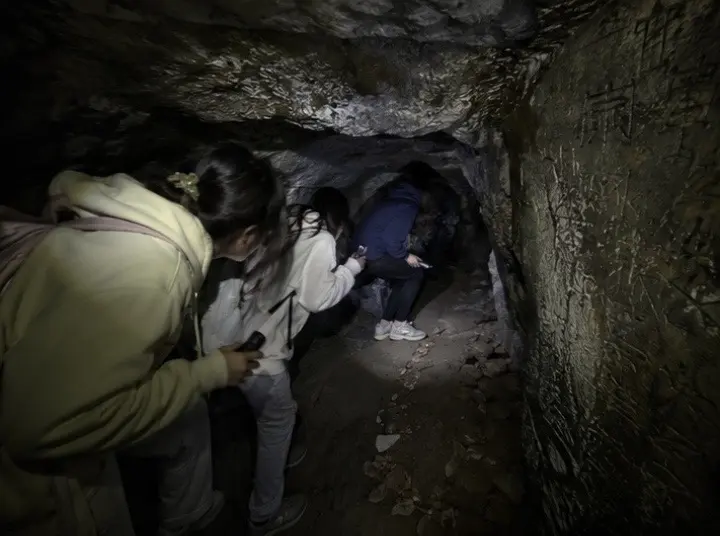

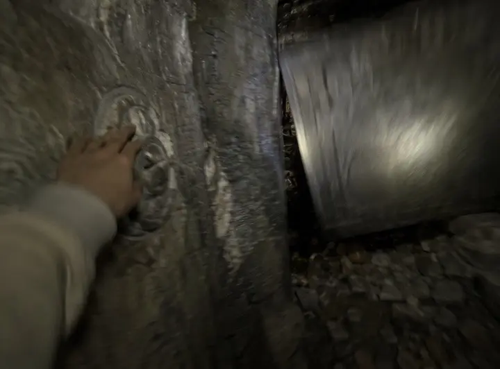

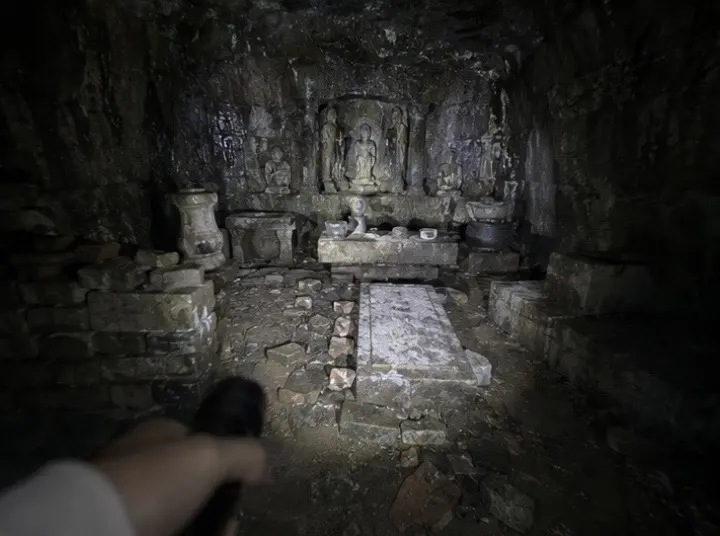

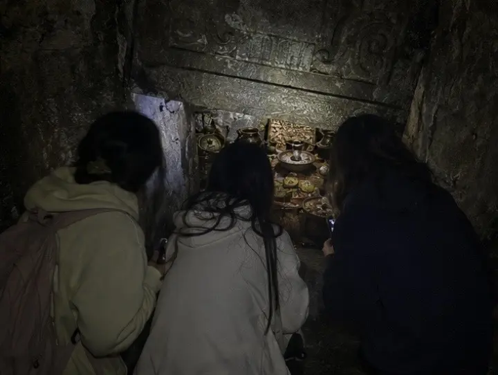

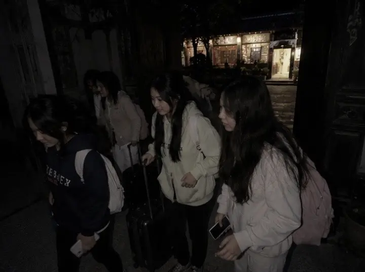

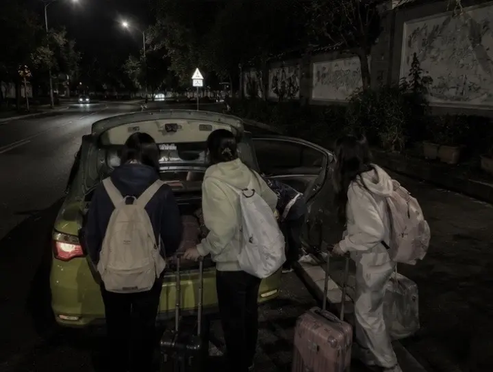

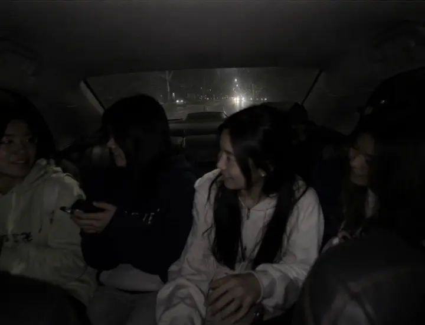

作者: [L-Ruins](https://www.douyin.com/user/MS4wLjABAAAAA5z4uipVWLok0v7E5SIXlcTgBbwDLpBji06mKzQFmMI)

发布时间：2026-7-20 7:0:32

收集时间：2026-7-29 17:55:33

统计信息：点赞数（2419），评论数（98），收藏数（359），分享数（559） 

原文地址：[谁能想到一场普通的云贵散心之旅，差点让我们四个人惹上大麻烦。 我们四个老友从信阳出发，坐长途火车中转...](https://www.douyin.com/note/7664377863898381926) 

