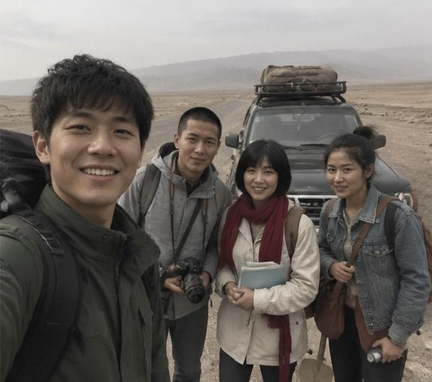
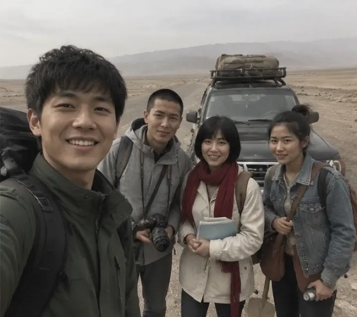
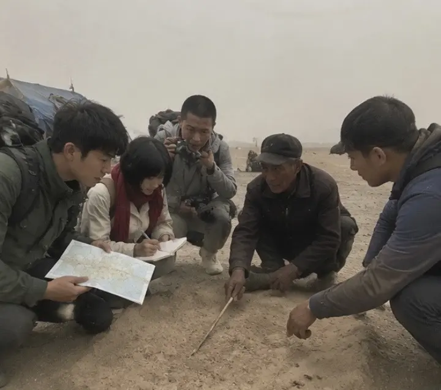
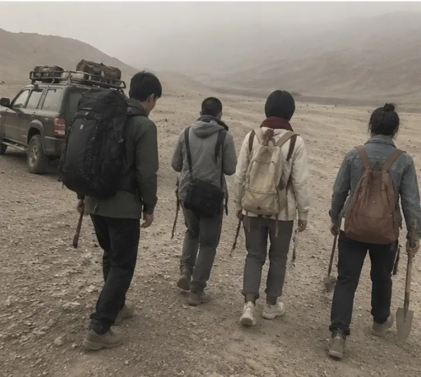
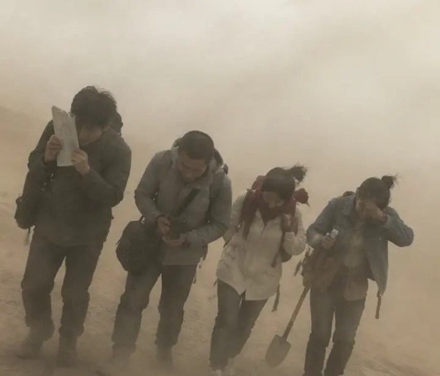
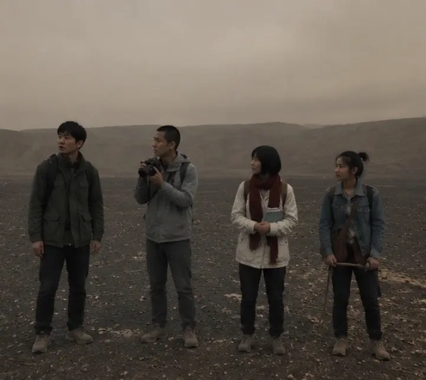
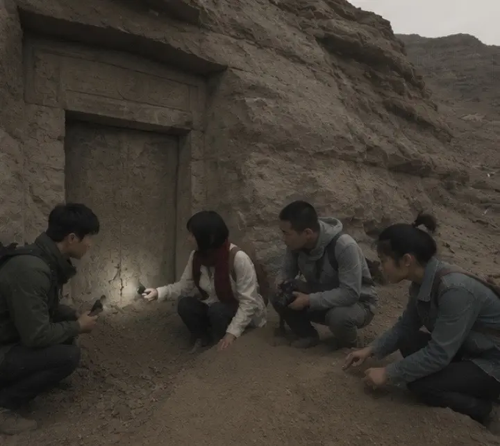
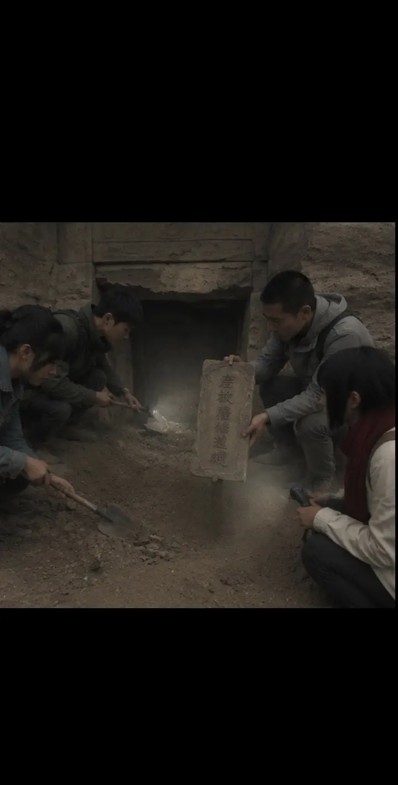
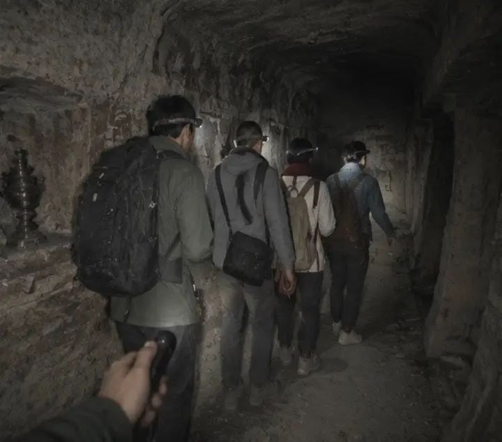

[toc]

# 正文

谁能想到，大学考古专业的毕业实习，会变成一场直面仙道诡秘的惊魂历险。
我们四个还没褪去学生气，背着简陋装备跟着向导扎进漫天黄沙戈壁，一路顶着遮天蔽日的沙尘暴徒步，越野车碾过荒芜戈壁，满心只期待找到唐代古遗迹，完成实习考察报告。
顺着戈壁土丘找到被黄沙半掩埋的石室古墓，撬开封门石，清理出刻着“唐敕隐修道规”的石碑，穿过狭长幽暗的壁画甬道，满墙古画、晦涩古文，都在诉说墓主人追求尸解成仙的过往。我们打着手电细细测绘壁画、记录文字，一点点掀开这座古墓的秘密。
合力挪开厚重石椁盖板，石棺里只剩一件褪色道袍，颈间挂着完整玉坠。墙壁上绘着墓主飞升画像，旁边写着诡异篆字，我们只当是古人臆想的修仙壁画，埋头清理墓室文物，全然没察觉到暗处涌动的阴气。
直到壁画虚影化作半透明人形，千年尸解仙的魂魄从石棺中显现，整个墓室沙尘狂舞，阴冷气息裹住我们四人。原来他千年困于此，靠墓穴阵法等待完整尸解飞升，我们一路清理壁画、挪动石棺、扰动墓穴风水，无意间破了他维持千年的阵局。
仙魂震怒，墓室石壁崩裂碎石纷飞，我们握着洛阳铲、铁锹慌忙抵挡，打碎维系他魂魄的玉饰，彻底斩断他飞升的契机。黄沙灌满古墓甬道，千年修仙梦，最终断送在我们几个实习学生手里。
走出古墓回望戈壁土丘，只剩满袖黄沙，方才墓穴里惊心动魄的一切，像一场真实又荒诞的黄沙大梦。考古探的是古人历史，这次，我们撞见了史书不敢记载的仙诡秘事。
#考古奇遇 #沙漠古墓 #尸解仙 #探险纪实

%

作者: [L-Ruins](https://www.douyin.com/user/MS4wLjABAAAAA5z4uipVWLok0v7E5SIXlcTgBbwDLpBji06mKzQFmMI)

发布时间：2026-7-23 8:43:51

收集时间：2026-7-29 19:3:9

统计信息：点赞数（898），评论数（30），收藏数（193），分享数（88） 

原文地址：[谁能想到，大学考古专业的毕业实习，会变成一场直面仙道诡秘的惊魂历险。 我们四个还没褪去学生气，背着简...](https://www.douyin.com/note/7665517745018555758) 

